# Guía Completa de Programación Orientada a Objetos

## Material de Estudio Académico para Evaluación Universitaria

---

## Prólogo

La **Programación Orientada a Objetos (POO)** no es una técnica de codificación: es un **paradigma de diseño** que transforma la manera en que los ingenieros modelan, estructuran y razonan sobre sistemas complejos. Desde su consolidación en los años 80 y 90 (Smalltalk, C++, Java, C#), se ha convertido en el enfoque dominante para construir software mantenible, extensible y escalable.

Sin embargo, existe una brecha frecuente entre **saber la sintaxis** (declarar clases, usar `extends`, escribir `@Override`) y **comprender el paradigma** (por qué existe la abstracción, cuándo conviene composición sobre herencia, cómo el polimorfismo habilita diseño extensible, qué implicaciones tiene un contrato mal diseñado). Esta guía cierra esa brecha.

El documento asume nociones básicas de programación y busca **dominio real** de los conceptos: no solo reproducir definiciones, sino analizar código, interpretar UML, justificar decisiones de diseño y reconocer errores comunes. Se apoya en Java como lenguaje de referencia por su tipado estático, su modelo de objetos maduro y su amplia presencia académica e industrial, aunque los conceptos aplican a C#, Kotlin, Scala, Python y otros lenguajes orientados a objetos.

---

## Objetivos de Aprendizaje

Al finalizar el estudio de este documento, el estudiante será capaz de:

1. **Explicar** el paradigma orientado a objetos desde sus fundamentos filosóficos, técnicos y de ingeniería.
2. **Diferenciar** POO de otros paradigmas (estructurada, funcional, declarativa, lógica, orientada a eventos) y reconocer cuándo cada uno es apropiado.
3. **Modelar** sistemas mediante clases, objetos, responsabilidades y relaciones.
4. **Aplicar** los cuatro pilares (abstracción, encapsulamiento, herencia y polimorfismo) con criterio de diseño.
5. **Interpretar y construir** diagramas UML coherentes con el código.
6. **Traducir** UML a código Java y viceversa con fidelidad semántica.
7. **Analizar** código orientado a objetos identificando decisiones de diseño y sus implicaciones.
8. **Justificar** cuándo usar clase abstracta vs interfaz, herencia vs composición, inmutabilidad vs mutabilidad, etc.
9. **Detectar** errores conceptuales, de diseño y de implementación frecuentes.
10. **Resolver** problemas de evaluación teóricos y prácticos con rigor técnico, aplicando principios como SRP, OCP, LSP, ISP, DIP y "composición sobre herencia".

---

## Tabla de Contenidos

1. [¿Qué es la Programación Orientada a Objetos?](#1-qué-es-la-programación-orientada-a-objetos)
2. [POO vs otros paradigmas](#2-poo-vs-otros-paradigmas)
3. [Objetos y Clases](#3-objetos-y-clases)
4. [Abstracción](#4-abstracción)
5. [Encapsulamiento](#5-encapsulamiento)
6. [Herencia](#6-herencia)
7. [Polimorfismo](#7-polimorfismo)
8. [UML y Relaciones entre Clases](#8-uml-y-relaciones-entre-clases)
9. [Principios de Diseño Orientado a Objetos](#9-principios-de-diseño-orientado-a-objetos)
10. [Sistema Integrador: Sistema Académico](#10-sistema-integrador-sistema-académico)
11. [¿Cómo se relacionan todos los conceptos?](#11-cómo-se-relacionan-todos-los-conceptos)
12. [Banco de Preguntas](#12-banco-de-preguntas)
13. [Simulacro de Evaluación](#13-simulacro-de-evaluación)
14. [Glosario](#14-glosario)
15. [Repaso de Alto Rendimiento](#15-repaso-de-alto-rendimiento)
16. [Checklist Final de Preparación](#16-checklist-final-de-preparación)

---

## Mapa Conceptual General

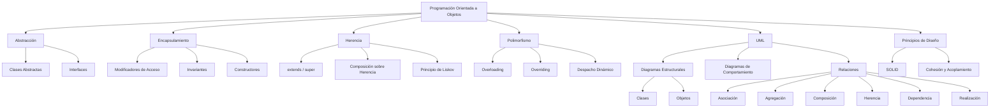

El mapa muestra cómo los cuatro pilares se materializan en mecanismos concretos (clases abstractas, interfaces, `extends`, `@Override`), cómo UML provee el lenguaje de modelado que conecta diseño e implementación, y cómo los principios de diseño guían las decisiones.

---

# 1. ¿Qué es la Programación Orientada a Objetos?

## 1.1 Definición formal

La **Programación Orientada a Objetos (POO)** es un **paradigma de programación** que organiza el diseño y la implementación de software alrededor de **objetos**: entidades que encapsulan **estado** (datos) y **comportamiento** (operaciones), y que **interactúan entre sí** mediante el envío de **mensajes**.

Alan Kay, considerado el padre del término (Smalltalk, Xerox PARC), resumió la idea en una frase frecuentemente citada:

> "La orientación a objetos es un estilo de programación en el que el diseño se organiza alrededor de objetos y sus interacciones, más que alrededor de funciones y datos separados."

Conviene precisar que esta cita se atribuye a Kay en distintas formulaciones. La idea central —que los objetos son **unidades de responsabilidad** que colaboran— se mantiene independientemente de la formulación exacta.

## 1.2 ¿Qué problema intenta resolver?

Los paradigmas anteriores (estructurada, procedural) **separan datos y funciones**. En sistemas pequeños esto es manejable; cuando el sistema crece, aparecen problemas estructurales:

- **Estado global vulnerable**: cualquier función puede modificar los datos.
- **Baja reutilización**: las funciones dependen de estructuras de datos concretas.
- **Rastreo difícil**: determinar quién modifica qué se vuelve una tarea de auditoría.
- **Extensión costosa**: añadir variantes obliga a modificar código existente (violando el principio Abierto/Cerrado).
- **Modelado débil del dominio**: el código refleja la estructura del programa, no la del negocio.

La POO responde agrupando **datos y operaciones relacionadas** en una unidad cohesiva (el objeto), y permitiendo que las variaciones se manejen mediante **especialización** y **sustitución polimórfica**.

## 1.3 Modelar un sistema mediante objetos

Modelar es construir una **representación abstracta** del dominio del problema. Al modelar con objetos:

1. **Identificamos entidades** relevantes del dominio (Cliente, Pedido, Producto).
2. **Determinamos su estado** (qué información guardan).
3. **Determinamos su comportamiento** (qué operaciones ofrecen).
4. **Definimos sus responsabilidades** (qué les corresponde hacer y qué delegan).
5. **Establecemos sus relaciones** (quién conoce a quién y con qué fuerza).

Un buen modelo **no replica la base de datos** ni la estructura del programa: refleja el **lenguaje del dominio**.

## 1.4 Componentes fundamentales de un objeto

### Estado

Conjunto de **atributos** (datos) que el objeto mantiene. Representa "cómo está" el objeto en un momento dado.

```java
private double saldo; // estado de una CuentaBancaria
```

### Comportamiento

Conjunto de **métodos** (operaciones) que definen "qué sabe hacer" el objeto y cómo modifica su estado.

```java
public void depositar(double monto) {
    if (monto <= 0) throw new IllegalArgumentException("Monto inválido");
    this.saldo += monto;
}
```

### Identidad

Cada objeto es **único e irrepetible**, incluso si tiene el mismo estado que otro. La identidad se materializa en su **referencia en memoria**. Dos objetos con idéntico estado siguen siendo dos objetos distintos.

```java
CuentaBancaria c1 = new CuentaBancaria("001", 1000);
CuentaBancaria c2 = new CuentaBancaria("001", 1000);
System.out.println(c1 == c2);        // false → identidades distintas
System.out.println(c1.equals(c2));   // depende de la implementación de equals()
```

**Profundización:** `==` compara **referencias** (identidad); `equals()` compara **contenido lógico**, siempre que se sobrescriba correctamente. Por defecto, `Object.equals()` es equivalente a `==`. Si se sobrescribe `equals()`, es **obligatorio** sobrescribir `hashCode()` para mantener el contrato: si `a.equals(b)`, entonces `a.hashCode() == b.hashCode()`.

### Responsabilidad

Cada objeto debe saber hacer **lo que le corresponde** y delegar lo demás. Este principio (Grady Booch) conduce a sistemas con **bajo acoplamiento y alta cohesión**.

### Interacción y mensajes

Los objetos **no son islas**. Se comunican enviándose **mensajes** (en lenguajes como Java, esto se materializa como **invocaciones a métodos**).

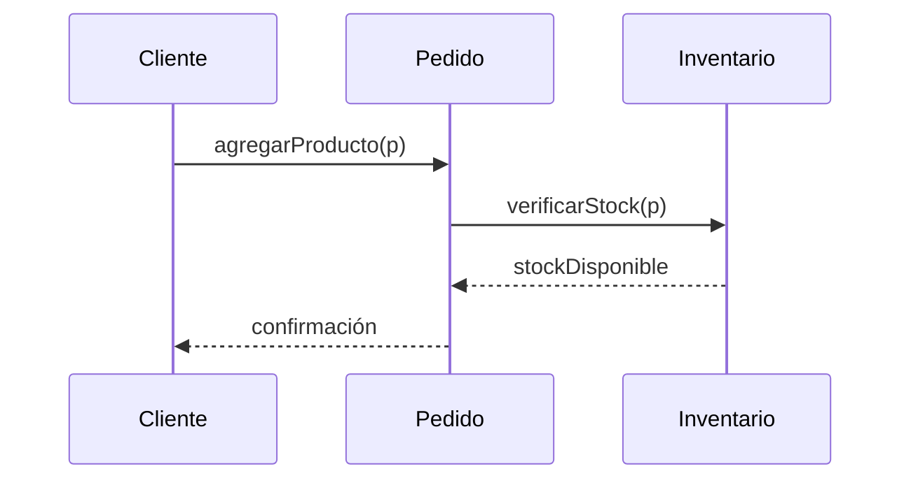

## 1.5 Clases y objetos como elementos fundamentales

- Una **clase** es la **plantilla** o **molde** que describe estructura (atributos) y comportamiento (métodos).
- Un **objeto** es una **instancia concreta** de esa clase, con estado propio en memoria.

**Clase : Objeto :: Plano : Edificio :: Receta : Platillo**

| Aspecto | Clase | Objeto |
|---------|-------|--------|
| Naturaleza | Tipo (compilación) | Valor (ejecución) |
| Existencia | Definición en código | Instancia en memoria (heap) |
| Estado | Declaración de atributos | Valores concretos |
| Analogía | Plano, receta, molde | Casa, platillo, pieza |
| Cantidad | Una por definición | Muchas por clase |

## 1.6 Los cuatro pilares

### Abstracción

Capacidad de **modelar sólo los aspectos esenciales** de un concepto, ignorando los detalles irrelevantes para el contexto. Se materializa mediante **clases abstractas** e **interfaces**.

### Encapsulamiento

Mecanismo que **oculta el estado interno** de un objeto y sólo expone una **interfaz pública controlada**. Protege la **invariante** del objeto.

### Herencia

Mecanismo por el cual una **subclase** reutiliza, extiende o especializa el comportamiento de una **superclase**. Establece relación **"es un"**.

### Polimorfismo

Capacidad de que una **misma referencia** pueda invocar comportamientos **diferentes** según el **tipo real** del objeto en tiempo de ejecución.

## 1.7 Ventajas

- **Reutilización** mediante herencia y composición.
- **Mantenibilidad** gracias al encapsulamiento y bajo acoplamiento.
- **Extensibilidad** gracias al polimorfismo (principio Abierto/Cerrado).
- **Modelado natural** de dominios complejos.
- **Modularidad** que facilita trabajo en equipo.
- **Trazabilidad** entre modelo conceptual y código.

## 1.8 Desventajas y limitaciones

- **Curva de aprendizaje** más pronunciada.
- **Overhead** de memoria/tiempo comparado con soluciones procedurales simples.
- **Riesgo de sobrediseño**: crear jerarquías innecesarias.
- **Mal uso de herencia** genera acoplamiento rígido.
- En programas muy pequeños, la POO puede ser **excesiva**.

## 1.9 ¿Cuándo es apropiado?

- Sistemas con **dominios ricos** y reglas de negocio complejas.
- Aplicaciones que **evolucionarán** (requisitos cambiantes).
- Sistemas **grandes** desarrollados por **equipos**.
- Software con múltiples **variantes de comportamiento**.

## 1.10 ¿Cuándo puede ser innecesariamente compleja?

- **Scripts pequeños** (10–50 líneas) con lógica secuencial.
- **Prototipos desechables**.
- **Algoritmos matemáticos puros** con poca modelación de dominio.
- **Procesamiento batch** sin entidades persistentes.

## 1.11 Ejemplo conceptual

Imagina un **sistema de zoo**. En lugar de tener:

```
funcion alimentar_leon(nombre, edad, peso)
funcion alimentar_tigre(nombre, edad, peso)
funcion alimentar_elefante(nombre, edad, peso)
```

Con POO tenemos una clase `Animal` con subclases `Leon`, `Tigre`, `Elefante`, cada una responsable de su propia alimentación.

## 1.12 Ejemplo en Java

```java
// Abstracción: definimos QUÉ hace un animal, no CÓMO
public abstract class Animal {
    private final String nombre;   // encapsulamiento + inmutabilidad
    private final int edad;

    public Animal(String nombre, int edad) {
        if (nombre == null || nombre.isBlank())
            throw new IllegalArgumentException("Nombre requerido");
        if (edad < 0)
            throw new IllegalArgumentException("Edad inválida");
        this.nombre = nombre;
        this.edad = edad;
    }

    public String getNombre() { return nombre; }
    public int getEdad() { return edad; }

    // Comportamiento abstracto: cada subclase lo define
    public abstract String emitirSonido();
    public abstract void alimentar();
}

public class Leon extends Animal {
    public Leon(String nombre, int edad) { super(nombre, edad); }

    @Override
    public String emitirSonido() { return "Rugido"; }

    @Override
    public void alimentar() {
        System.out.println(getNombre() + " come carne");
    }
}

public class Elefante extends Animal {
    public Elefante(String nombre, int edad) { super(nombre, edad); }

    @Override
    public String emitirSonido() { return "Barrito"; }

    @Override
    public void alimentar() {
        System.out.println(getNombre() + " come vegetales");
    }
}

// Uso polimórfico
public class Zoo {
    public static void main(String[] args) {
        List<Animal> animales = List.of(
            new Leon("Simba", 5),
            new Elefante("Dumbo", 12)
        );

        for (Animal a : animales) {
            System.out.println(a.getNombre() + ": " + a.emitirSonido());
            a.alimentar(); // polimorfismo: se ejecuta el método real
        }
    }
}
```

## 1.13 Análisis del ejemplo

| Elemento | Concepto POO | Explicación |
|----------|--------------|-------------|
| `Animal` | Abstracción + Encapsulamiento | Define el contrato común; oculta `nombre` y `edad` con `private`. |
| `Leon extends Animal` | Herencia | Especializa el comportamiento general. |
| `emitirSonido()` | Polimorfismo | Cada subclase da su propia implementación. |
| `List<Animal>` | Polimorfismo + Abstracción | Trabajamos con la abstracción, no con tipos concretos. |
| `private final String nombre` | Encapsulamiento + inmutabilidad | Sólo accesible mediante getters; no se reasigna. |

**Observación de diseño:** el uso de `final` en los atributos hace que `Animal` sea (casi) inmutable. Esto simplifica el razonamiento, evita condiciones de carrera y previene mutaciones accidentales. La inmutabilidad es un criterio de diseño que conviene aplicar por defecto, y sólo abandonar cuando la mutación sea estrictamente necesaria.

## 1.14 Errores comunes

1. **Confundir POO con "usar clases"**: se puede escribir código procedural dentro de clases y no es POO real.
2. **Creer que encapsulamiento = crear getters/setters para todo**: eso es sólo un aspecto.
3. **Pensar que herencia es sinónimo de reutilización óptima**: muchas veces composición es mejor.
4. **Definir clases anémicas**: sólo datos, sin comportamiento; la lógica queda en clases de servicio.
5. **Malinterpretar "objeto" como sinónimo de "instancia de una clase cualquiera"**: no todo lo instanciable es un buen objeto de dominio.
6. **Ignorar la identidad**: comparar objetos con `==` cuando se quiere comparar contenido.
7. **No sobrescribir `hashCode()` al sobrescribir `equals()`**: rompe el contrato y produce errores en `HashMap`/`HashSet`.

## 1.15 Preguntas de evaluación

1. Define POO con tus propias palabras sin usar la palabra "objeto".
2. ¿Qué diferencia hay entre "estado" e "identidad" de un objeto?
3. Explica por qué un objeto con el mismo estado que otro sigue siendo distinto.
4. ¿Qué significa "responsabilidad" en el contexto de POO?
5. ¿Cuál es la relación entre "mensaje" y "método"?
6. Enumera y explica los cuatro pilares.
7. ¿Por qué la POO puede no ser apropiada para scripts pequeños?
8. Da un ejemplo de sobrediseño con POO.
9. ¿Cómo se relacionan abstracción y polimorfismo?
10. ¿Cuándo la encapsulación se vuelve un obstáculo?

## 1.16 Respuestas razonadas

1. Paradigma que organiza el software en unidades autónomas que combinan datos y comportamiento, y que colaboran enviándose mensajes.
2. El **estado** son los valores actuales de los atributos; la **identidad** es la referencia única e irrepetible que distingue a un objeto de otro.
3. Porque la identidad no depende del estado. Dos cuentas con el mismo saldo siguen siendo dos cuentas diferentes.
4. Es la obligación de un objeto de saber resolver aquello que le compete, delegando lo demás a otros objetos.
5. El mensaje es la **intención** (conceptual); el método es la **implementación** concreta que se ejecuta al recibirlo.
6. Abstracción, encapsulamiento, herencia, polimorfismo. (Explicar cada uno con ejemplo breve.)
7. Porque introduce estructura adicional (clases, jerarquías) que no aporta valor cuando no hay dominio que modelar ni evolución prevista.
8. Crear una jerarquía `GestorDeArchivo → GestorDeArchivoTexto → GestorDeArchivoTextoUTF8` cuando un simple método bastaba.
9. La abstracción define **qué** se ofrece; el polimorfismo permite **sustituir** implementaciones concretas sin que el cliente lo sepa.
10. Cuando se usa para **bloquear el acceso al estado que sí debería exponerse**, generando decenas de getters/setters que en realidad sólo reproducen acceso directo.

## 1.17 Puntos clave para memorizar

- **POO = objetos + mensajes + estado + comportamiento + identidad.**
- Los cuatro pilares: **A-E-H-P** (Abstracción, Encapsulamiento, Herencia, Polimorfismo).
- **Objeto** = instancia única de una clase, con estado y comportamiento.
- **Mensaje** = invocación; **método** = implementación.
- La POO modela el **dominio**, no la estructura del programa.
- No es la única opción ni la mejor en todos los casos.

### En pocas palabras

> La POO es un paradigma donde el software se construye con **objetos autónomos** que combinan datos y comportamiento, colaboran por **mensajes**, y se organizan en **clases** que capturan la estructura y el comportamiento común.

> ### ¿Cómo reconocer este concepto en un examen?
> Cuando la pregunta mencione "paradigma", "modelado del dominio", "unidades autónomas", "colaboración por mensajes" o pida "explicar por qué POO y no código procedural", estás en este bloque.

---

# 2. POO vs otros paradigmas

## 2.1 Programación estructurada

### ¿Qué es?

Paradigma popularizado por Edsger Dijkstra y otros, que organiza el código mediante **secuencia, selección e iteración**, evitando el uso indiscriminado de `goto`. El programa se descompone en **funciones/procedimientos**.

### ¿Cómo organiza el código?

- **Datos**: variables globales o locales, agrupadas en estructuras (structs, records).
- **Lógica**: funciones/procedimientos independientes que operan sobre esos datos.

### Ventajas

- Sencillez conceptual.
- Adecuada para algoritmos de cálculo.
- Eficiencia.
- Amplio soporte en todos los lenguajes.

### Limitaciones

- Datos y funciones separados → fácil corrupción del estado.
- Difícil de extender sin modificar lo existente.
- Escasa modelación del dominio.

### Ejemplo

```c
// Programación estructurada (pseudocódigo tipo C)
struct Cuenta {
    char id[10];
    double saldo;
};

void depositar(struct Cuenta* c, double monto) {
    if (monto <= 0) return;
    c->saldo += monto;
}

void retirar(struct Cuenta* c, double monto) {
    if (monto <= 0 || monto > c->saldo) return;
    c->saldo -= monto;
}
```

Los datos (`struct Cuenta`) y las funciones (`depositar`, `retirar`) están **separados**. Nada impide que otro código modifique `c->saldo` directamente.

## 2.2 POO

### ¿Cómo organiza el software?

- **Clases**: encapsulan datos + comportamiento.
- **Objetos**: instancias con estado propio.
- **Responsabilidades**: cada objeto sabe lo que le compete.
- **Relaciones**: asociación, herencia, composición.

### Tabla comparativa: estructurada vs POO

| Aspecto | Programación Estructurada | Programación Orientada a Objetos |
|---------|---------------------------|----------------------------------|
| Unidad básica | Función / procedimiento | Clase / objeto |
| Organización | Por operaciones | Por entidades del dominio |
| Datos | Separados de la lógica | Encapsulados en objetos |
| Reutilización | Bibliotecas de funciones | Herencia, composición, interfaces |
| Extensibilidad | Modificar código existente | Añadir clases (Abierto/Cerrado) |
| Relación con el dominio | Débil | Fuerte (modelado) |
| Complejidad inicial | Baja | Media-alta |
| Adecuada para | Algoritmos, scripts | Sistemas complejos con dominio rico |
| Ejemplo lenguaje | C, Pascal, Fortran | Java, C++, C#, Python |

## 2.3 Otros paradigmas

### Programación procedural / procedimental

- **Definición**: subconjunto de la estructurada; enfatiza procedimientos que operan sobre datos.
- **Idea central**: "el programa es una secuencia de procedimientos".
- **Estructura**: procedimientos + datos globales.
- **Ejemplo**: la función `depositar` anterior.
- **Casos de uso**: utilidades CLI, parsers, scripts de sistema.
- **Relación con POO**: subyacente a ella (los métodos son procedimientos encapsulados).

### Programación funcional

- **Definición**: paradigma donde las funciones son **ciudadanos de primera clase** y se evitan **efectos secundarios**.
- **Idea central**: composición de funciones puras.
- **Estructura**: funciones que reciben y devuelven valores, sin estado mutable.
- **Lenguajes**: Haskell, Lisp, Clojure, F#; también soportado en Java (lambdas, streams).
- **Ejemplo**:
  ```java
  List<Integer> dobles = List.of(1, 2, 3).stream()
      .map(x -> x * 2)
      .toList();
  ```
- **Casos de uso**: procesamiento de datos, concurrencia, transformaciones.
- **Relación con POO**: coexisten (Java moderno es multiparadigma).

### Programación declarativa

- **Definición**: describe **qué** se quiere, no **cómo** obtenerlo.
- **Idea central**: el programador describe el resultado; el motor decide el procedimiento.
- **Ejemplo**: SQL, HTML, Prolog (declarativo lógico).
  ```sql
  SELECT nombre FROM estudiantes WHERE promedio > 4.0;
  ```
- **Casos de uso**: consultas, configuraciones, UI.

### Programación lógica

- **Definición**: se basa en **hechos y reglas**; el motor infiere conclusiones.
- **Ejemplo** (Prolog):
  ```prolog
  padre(juan, maria).
  abuelo(X, Z) :- padre(X, Y), padre(Y, Z).
  ```
- **Casos de uso**: sistemas expertos, IA simbólica, procesamiento de lenguaje natural.

### Programación orientada a eventos

- **Definición**: el flujo se determina por **eventos** externos (clicks, mensajes, sensores).
- **Estructura**: bucles de eventos + manejadores (handlers).
- **Ejemplo**: aplicaciones GUI, servidores reactivos, Node.js.
- **Relación con POO**: los manejadores suelen ser objetos/observadores.

### Programación multiparadigma

- Lenguajes como **Java, C++, Python, JavaScript, Kotlin, Scala** soportan **varios paradigmas** simultáneamente.

## 2.4 Tabla comparativa general

| Paradigma | Unidad básica | Estado | Enfoque | Ejemplo |
|-----------|---------------|--------|---------|---------|
| Estructurada | Función | Global/local | Secuencia + control | C |
| Procedural | Procedimiento | Global/local | Operaciones sobre datos | Pascal |
| Orientada a Objetos | Objeto | Encapsulado | Entidades del dominio | Java |
| Funcional | Función pura | Inmutable | Composición | Haskell |
| Declarativa | Expresión | Variable | Qué, no cómo | SQL |
| Lógica | Hecho + Regla | Base de conocimiento | Inferencia | Prolog |
| Orientada a Eventos | Manejador | Estado del evento | Reacción | JS (DOM) |

## 2.5 Errores comunes

1. Creer que **POO sustituye completamente** a otros paradigmas.
2. Pensar que "usar clases" garantiza estar haciendo POO.
3. Asumir que la programación estructurada es "anticuada" — sigue siendo apropiada para muchos problemas.
4. Confundir **funcional** con "usar funciones".

## 2.6 Preguntas de evaluación

1. ¿Qué diferencia sustancial hay entre programación estructurada y POO?
2. Da un ejemplo donde la programación estructurada sea preferible.
3. ¿Por qué Java se considera multiparadigma?
4. Explica con un ejemplo qué es una función pura.
5. ¿En qué se diferencia programación declarativa de imperativa?
6. ¿Cuándo es apropiada la programación orientada a eventos?
7. ¿Cómo se relacionan POO y programación funcional en Java moderno?
8. ¿Qué ventaja ofrece POO sobre estructurada en sistemas que cambian?
9. Enumera tres limitaciones de la programación estructurada.
10. ¿Se puede hacer POO sin herencia? Justifica.

### En pocas palabras

> No hay paradigma "mejor". Hay **paradigmas adecuados** a cada problema. La POO brilla en dominios ricos y sistemas extensibles; la estructurada en algoritmos puros; la funcional en transformaciones sin estado; la declarativa en consultas.

---

# 3. Objetos y Clases

## 3.1 Objeto

### Definición

Un **objeto** es una **entidad software** que encapsula:
- **Estado** (valores actuales de sus atributos).
- **Comportamiento** (métodos que modifican o consultan el estado).
- **Identidad** (referencia única).

### Estado

Valores en un instante. Cambia con la ejecución de métodos.

### Comportamiento

Operaciones disponibles: **consultas** (no mutan) y **comandos** (mutan).

### Identidad

Referencia única e irrepetible.

### Atributos

Variables internas del objeto. Definen su estado.

### Métodos

Operaciones que definen su comportamiento.

### Instancia

Sinónimo de "objeto creado a partir de una clase".

## 3.2 Clase

### Definición

Una **clase** es una **plantilla** que describe:
- Atributos (qué tendrá).
- Métodos (qué podrá hacer).
- Constructores (cómo se inicializa).

### Estructura

```java
[modificadores] class NombreClase [extends ...] [implements ...] {
    // atributos
    // constructores
    // métodos
}
```

### Atributos

```java
private String nombre;
private int edad;
```

### Métodos

```java
public void saludar() { ... }
```

### Constructor

```java
public Persona(String nombre, int edad) {
    this.nombre = nombre;
    this.edad = edad;
}
```

### Responsabilidad

La clase debe representar **una sola idea cohesiva** (principio de responsabilidad única). Si la clase necesita más de una razón para cambiar, probablemente debería dividirse.

## 3.3 Diferencia entre clase y objeto

1. **Conceptual**: la clase es la **forma**; el objeto es la **sustancia**.
2. **Técnica**: la clase es un **tipo** (existe en tiempo de compilación); el objeto es un **valor en memoria** (existe en tiempo de ejecución).
3. **Analogía**: la clase es el **plano**; el objeto es la **casa**.
4. **Código**:
   ```java
   Persona p = new Persona("Ana", 30);
   // Persona → clase
   // p       → referencia al objeto
   // new ... → creación del objeto
   ```
5. **UML**: la clase se dibuja como un rectángulo con 3 compartimentos; un objeto como un rectángulo con nombre subrayado (`p: Persona`).

## 3.4 Instanciación, referencias y estado

- La instanciación (`new`) reserva memoria en el **heap**.
- La referencia (`p`) es una variable en el **stack** que apunta al objeto.
- Cada instancia tiene **su propio estado**.

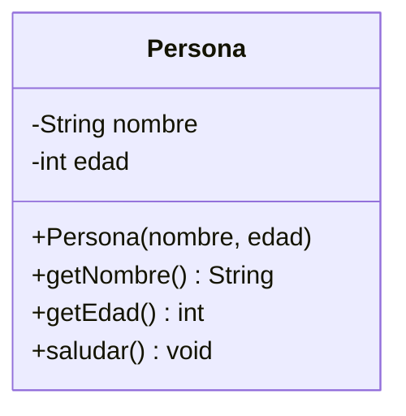

## 3.5 Diagrama de objetos (instancias)

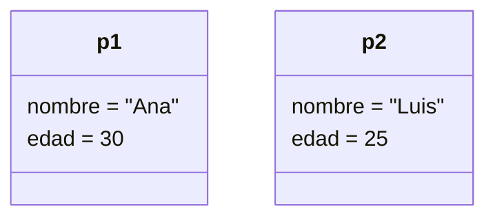

## 3.6 Código Java completo

```java
public class Persona {
    private final String nombre;
    private int edad;

    public Persona(String nombre, int edad) {
        if (nombre == null || nombre.isBlank())
            throw new IllegalArgumentException("Nombre requerido");
        if (edad < 0)
            throw new IllegalArgumentException("Edad inválida");
        this.nombre = nombre;
        this.edad = edad;
    }

    public String getNombre() { return nombre; }
    public int getEdad() { return edad; }

    public void cumplirAnios() {
        this.edad++;
    }

    public String saludar() {
        return "Hola, soy " + nombre + " y tengo " + edad + " años";
    }
}

public class Main {
    public static void main(String[] args) {
        Persona ana = new Persona("Ana", 30);
        Persona luis = new Persona("Luis", 25);

        ana.cumplirAnios();
        System.out.println(ana.saludar());   // Hola, soy Ana y tengo 31 años
        System.out.println(luis.saludar());  // Hola, soy Luis y tengo 25 años
    }
}
```

## 3.7 Análisis línea por línea

| Línea | Qué ocurre |
|-------|------------|
| `public class Persona {` | Declaración de la clase. |
| `private final String nombre;` | Atributo inmutable. |
| `private int edad;` | Atributo mutable. |
| `public Persona(...)` | Constructor con validaciones (invariantes). |
| `this.nombre = nombre;` | `this` distingue atributo de parámetro. |
| `public void cumplirAnios()` | Comando que muta el estado. |
| `Persona ana = new Persona("Ana", 30);` | Instanciación: reserva memoria, ejecuta constructor, asigna referencia. |
| `ana.cumplirAnios();` | Modifica **solo el estado de ana**. |
| `ana.saludar()` | Consulta que lee el estado actual. |

## 3.8 `==` vs `equals()`

Esta distinción es crítica y suele evaluarse:

- **`==`** compara **referencias**. Dos variables apuntan al mismo objeto si `a == b`.
- **`equals()`** compara **contenido lógico**, si la clase lo sobrescribe correctamente.

```java
String s1 = new String("hola");
String s2 = new String("hola");
System.out.println(s1 == s2);        // false → objetos distintos
System.out.println(s1.equals(s2));   // true  → mismo contenido
```

**Contrato de `equals()`**: debe ser **reflexivo**, **simétrico**, **transitivo**, **consistente** y `x.equals(null)` debe retornar `false`. Si se sobrescribe, **también se debe sobrescribir `hashCode()`**.

```java
@Override
public boolean equals(Object o) {
    if (this == o) return true;
    if (!(o instanceof Persona p)) return false;
    return edad == p.edad && Objects.equals(nombre, p.nombre);
}

@Override
public int hashCode() {
    return Objects.hash(nombre, edad);
}
```

## 3.9 Errores frecuentes

1. **Confundir clase con objeto** en la respuesta de examen.
2. **Crear setters para todo**, anulando el encapsulamiento.
3. **No validar en el constructor**, permitiendo objetos en estado inválido.
4. **Olvidar `this`** cuando hay sombra de variables.
5. **Definir atributos `public`** por comodidad.
6. **Confundir identidad con igualdad de contenido** (uso incorrecto de `==` vs `equals`).
7. **Sobrescribir `equals()` sin `hashCode()`**.

## 3.10 Preguntas típicas de examen

1. ¿Cuál es la diferencia entre clase y objeto? Da ejemplo.
2. ¿Qué es la identidad de un objeto?
3. ¿Qué es un constructor y para qué sirve?
4. ¿Qué hace la palabra reservada `new`?
5. ¿Qué diferencia hay entre `==` y `equals()`?
6. ¿Cuándo dos objetos son "iguales"? ¿Cuándo son "idénticos"?
7. ¿Por qué se recomienda `private` en atributos?
8. ¿Qué significa que un objeto es una instancia?
9. ¿Qué es un atributo `final`?
10. ¿Cómo se relaciona UML con la definición de clase?

## 3.11 Ejercicio práctico

**Enunciado**: Define una clase `Libro` con atributos `titulo`, `autor`, `isbn`, `paginas` y `disponible`. Incluye constructor con validación, métodos `prestar()`, `devolver()`, `estaDisponible()`.

### Solución explicada

```java
public class Libro {
    private final String titulo;
    private final String autor;
    private final String isbn;
    private final int paginas;
    private boolean disponible;

    public Libro(String titulo, String autor, String isbn, int paginas) {
        if (titulo == null || titulo.isBlank()) throw new IllegalArgumentException();
        if (autor == null || autor.isBlank())  throw new IllegalArgumentException();
        if (isbn == null || isbn.isBlank())    throw new IllegalArgumentException();
        if (paginas <= 0)                      throw new IllegalArgumentException();

        this.titulo = titulo;
        this.autor = autor;
        this.isbn = isbn;
        this.paginas = paginas;
        this.disponible = true;
    }

    public boolean estaDisponible() { return disponible; }

    public void prestar() {
        if (!disponible)
            throw new IllegalStateException("El libro ya está prestado");
        this.disponible = false;
    }

    public void devolver() {
        if (disponible)
            throw new IllegalStateException("El libro ya está disponible");
        this.disponible = true;
    }

    public String getTitulo() { return titulo; }
    public String getAutor()  { return autor; }
    public String getIsbn()   { return isbn; }
    public int getPaginas()   { return paginas; }
}
```

**Puntos clave de la solución**:
- Uso de `final` para atributos inmutables tras la construcción.
- Validaciones en el constructor (preservan la **invariante**).
- Mutación de `disponible` sólo vía métodos con sentido de negocio (`prestar`, `devolver`), **no** mediante `setDisponible(boolean)`.

### En pocas palabras

> Clase = plantilla; objeto = instancia. El objeto combina estado, comportamiento e identidad. La instanciación usa `new`; las referencias apuntan a objetos en el heap.

---

# 4. Abstracción

## 4.1 ¿Qué es abstracción?

La **abstracción** es el proceso de **identificar y modelar los rasgos esenciales** de un concepto, **ignorando los detalles irrelevantes** en el contexto del problema.

> "Abstraer es decidir qué ignorar."

### Abstracción vs ocultamiento de información

Estrechamente relacionados, pero **distintos**:

- **Abstracción**: enfoque de **diseño**; qué representar.
- **Ocultamiento de información**: técnica de **implementación**; qué no exponer.

Ejemplo: al modelar `CuentaBancaria`, la **abstracción** decide que el saldo es relevante. El **ocultamiento** decide que el saldo se guarda en un `double` privado (no expuesto).

### Abstracción en POO

Se materializa en:
- **Clases abstractas** (abstracción parcial con estado).
- **Interfaces** (abstracción pura de contrato).

### ¿Qué exponer? ¿Qué ocultar?

**Exponer**: contrato (qué se puede hacer).
**Ocultar**: implementación (cómo se hace).

## 4.2 Clases abstractas

### ¿Qué son?

Clase que **no puede instanciarse** y que puede contener **métodos sin implementación** (abstractos) que las subclases deben implementar.

### Características

- Se declara con `abstract`.
- Puede tener **atributos**.
- Puede tener **métodos concretos** y **abstractos**.
- **Sí tiene constructor** (invocado por subclases con `super`).
- Una subclase **concreta** debe implementar todos los métodos abstractos.
- Puede tener **cero** métodos abstractos y seguir siendo no instanciable (útil para bloquear instanciación directa).

### Métodos abstractos vs concretos

```java
public abstract class Figura {
    protected final String color; // estado compartido

    public Figura(String color) { this.color = color; } // constructor

    public abstract double area();      // abstracto: subclases implementan
    public abstract double perimetro();

    public String getColor() { return color; } // concreto: reutilizable
}
```

### Cuándo utilizarlas

- Cuando varias clases comparten **estado y comportamiento**.
- Cuando quieres **forzar** un contrato parcial reutilizando código.
- Cuando necesitas **evolucionar** la clase base sin romper subclases (puedes añadir métodos concretos).

## 4.3 Interfaces

### ¿Qué son?

Un **contrato** que define un conjunto de métodos que las clases **implementadoras** deben ofrecer.

### Propósito

- Definir **qué** se ofrece, sin imponer **cómo**.
- Permitir **polimorfismo** entre clases no relacionadas por herencia.

### Contratos

```java
public interface Volador {
    void volar();                    // abstracto por defecto
    default void planear() {         // método default (Java 8+)
        System.out.println("Planeando...");
    }
    static Volador noVuela() {       // método estático (Java 8+)
        return () -> System.out.println("No vuela");
    }
}
```

### Métodos `default`: conflicto y resolución

Si dos interfaces declaran el mismo método `default`, la clase implementadora **debe** sobrescribirlo o será un error de compilación:

```java
interface A { default void hola() { System.out.println("A"); } }
interface B { default void hola() { System.out.println("B"); } }

class C implements A, B {
    @Override public void hola() {
        A.super.hola();  // desambiguación explícita
    }
}
```

### Múltiples interfaces

Una clase puede implementar **varias interfaces** — mecanismo de **herencia múltiple de tipo** en Java.

```java
public class Pato extends Animal implements Volador, Nadador { ... }
```

### Cuándo utilizarlas

- Cuando clases **no relacionadas** deben compartir un comportamiento.
- Cuando quieres definir **capacidades** ("puede volar", "puede pagar").
- Cuando necesitas **bajo acoplamiento** entre cliente y proveedor.

## 4.4 Clases abstractas vs interfaces

| Aspecto | Clase Abstracta | Interfaz |
|---------|-----------------|----------|
| Propósito | Reutilización de código + contrato parcial | Contrato puro (qué, no cómo) |
| Herencia | Simple (una sola) | Múltiple |
| Estado | Puede tener atributos de instancia | Sólo constantes `public static final` |
| Constructores | Sí | No |
| Métodos concretos | Sí | Sólo `default`, `static` y `private` (Java 9+) |
| Modificadores de métodos | Cualquiera | `public` implícito (o `private` en Java 9+) |
| Acoplamiento | Mayor (subclase depende de implementación) | Menor (contrato) |
| Evolución | Añadir métodos abstractos rompe subclases | Añadir `default` no rompe |
| Uso típico | Jerarquías "es un" | Capacidades "puede ser" |

## 4.5 Código comparativo

```java
// Clase abstracta: comparte estado y comportamiento
public abstract class Empleado {
    protected final String nombre;
    protected final double salarioBase;

    public Empleado(String nombre, double salarioBase) {
        this.nombre = nombre;
        this.salarioBase = salarioBase;
    }

    public abstract double calcularSalario();
    public String getNombre() { return nombre; }
}

// Interfaz: define capacidad adicional
public interface Bonificable {
    double calcularBonificacion();
}

// Una subclase concreta puede combinar ambos
public class Gerente extends Empleado implements Bonificable {
    private final double bonoAnual;

    public Gerente(String nombre, double salarioBase, double bonoAnual) {
        super(nombre, salarioBase);
        this.bonoAnual = bonoAnual;
    }

    @Override
    public double calcularSalario() {
        return salarioBase + calcularBonificacion() / 12;
    }

    @Override
    public double calcularBonificacion() { return bonoAnual; }
}
```

## 4.6 Diagrama Mermaid

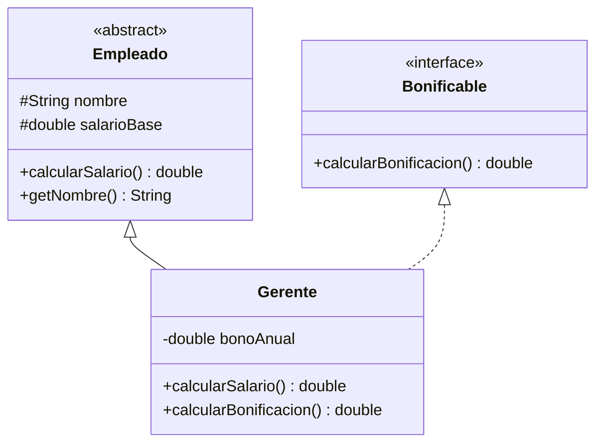

## 4.7 Errores frecuentes

1. Creer que **clase abstracta = interfaz con métodos abstractos**.
2. Intentar **instanciar** una clase abstracta.
3. Confundir **abstracción** con **encapsulamiento**.
4. Usar **interfaz con un solo método** cuando convendría una **interfaz funcional**.
5. Creer que las interfaces **no pueden tener código** (sí: `default`, `static`, `private` desde Java 9).
6. Abusar de métodos `default` para inyectar lógica no trivial (rompe el principio de contrato puro).

## 4.8 Preguntas de evaluación

1. Define abstracción en tus propias palabras.
2. ¿En qué se diferencia abstracción de encapsulamiento?
3. ¿Por qué una clase abstracta puede tener constructor?
4. ¿Cuándo elegir una interfaz sobre una clase abstracta?
5. ¿Qué es un método `default` en una interfaz?
6. ¿Por qué Java no permite herencia múltiple de clases, pero sí de interfaces?
7. ¿Puede una clase abstracta implementar una interfaz sin implementar sus métodos? Justifica.
8. Da un ejemplo donde clase abstracta es claramente superior a interfaz.
9. Da un ejemplo donde interfaz es claramente superior a clase abstracta.
10. ¿Qué problema resuelve la abstracción en un sistema grande?

### En pocas palabras

> **Abstracción** = modelar lo esencial, ignorar lo accesorio. **Clases abstractas** = abstracción parcial con estado. **Interfaces** = contrato puro.

---

# 5. Encapsulamiento

## 5.1 ¿Qué es?

**Encapsulamiento** es el mecanismo que:
1. **Oculta el estado interno** de un objeto.
2. **Expone una interfaz controlada** para interactuar con él.
3. **Preserva invariantes** validando toda mutación.

## 5.2 ¿Qué problema resuelve?

Sin encapsulamiento, cualquier código externo podría modificar el estado, dejándolo **inconsistente**. Ejemplo: modificar el saldo de una cuenta sin registrar la transacción.

## 5.3 Control del acceso al estado interno

Los **modificadores de acceso** establecen **quién** puede ver **qué**.

## 5.4 Invariantes

Un **invariante** es una condición que debe cumplirse **siempre** en un objeto válido.

Ejemplo: `saldo >= 0`. Si el estado se expone directamente, la invariante puede violarse.

## 5.5 Modificadores de acceso (Java)

| Modificador | Misma clase | Mismo paquete | Subclase (otro paquete) | Otros |
|-------------|-------------|---------------|--------------------------|-------|
| `public` | ✅ | ✅ | ✅ | ✅ |
| `protected` | ✅ | ✅ | ✅ | ❌ |
| *(default)* | ✅ | ✅ | ❌ | ❌ |
| `private` | ✅ | ❌ | ❌ | ❌ |

**Precisión importante sobre `protected`:** `protected` permite acceso desde el **mismo paquete** (independientemente de la herencia) y desde **subclases en otros paquetes**. Es decir, no es exclusivo de la relación de herencia.

### Recomendación general

- **Atributos**: `private`.
- **Métodos de negocio**: `public`.
- **Métodos internos**: `private` o `protected`.
- **API estable**: `public`.

## 5.6 Getters y setters

### ¿Qué son?

- **Getter**: método que retorna el valor de un atributo.
- **Setter**: método que modifica el valor de un atributo.

### ¿Cuándo utilizarlos?

- **Getter**: cuando el cliente necesita **consultar** el estado.
- **Setter**: sólo cuando el cliente legítimamente necesita **modificar** el atributo.

### ¿Cuándo NO crear setters?

- Cuando el atributo es **derivado** de otros.
- Cuando el cambio debe pasar por **reglas de negocio**.
- Cuando el objeto debería ser **inmutable**.

### Validación

```java
public void setSalario(double nuevoSalario) {
    if (nuevoSalario < 0)
        throw new IllegalArgumentException("El salario no puede ser negativo");
    this.salario = nuevoSalario;
}
```

### Diseño orientado a comportamiento

En lugar de:

```java
cuenta.setSaldo(cuenta.getSaldo() + monto);
```

Preferir:

```java
cuenta.depositar(monto);
```

Esto se conoce como **"Tell, Don't Ask"**: no preguntes a un objeto por su estado para decidir tú qué hacer; dile qué hacer y deja que él decida.

### Retorno de referencias mutables

Un getter que retorna una referencia mutable **rompe el encapsulamiento**:

```java
// ❌ Peligroso
public List<String> getMovimientos() { return movimientos; }

// ✅ Correcto
public List<String> getMovimientos() { return List.copyOf(movimientos); }
```

## 5.7 Constructores

### ¿Qué son?

Método especial que **inicializa** un objeto al crearlo.

### Constructor por defecto

Si no se declara ninguno, Java crea uno sin argumentos que inicializa a valores por defecto (`0`, `null`, `false`).

### Constructores parametrizados

```java
public Cuenta(String titular, double saldoInicial) { ... }
```

### Sobrecarga de constructores

Varios constructores con **diferente firma**:

```java
public Cuenta(String titular) {
    this(titular, 0.0);
}

public Cuenta(String titular, double saldoInicial) { ... }
```

### `this` y `super`

- `this(...)` → invoca otro constructor de **la misma clase**.
- `super(...)` → invoca el constructor de **la superclase**.

Deben ser **la primera instrucción** del constructor.

## 5.8 Destructores

### En Java NO existen destructores

Java cuenta con un **Garbage Collector (GC)** que libera la memoria de objetos **sin referencias**. No se puede forzar la liberación de manera determinista (aunque existe `System.gc()` como **sugerencia**).

### Diferencia con C++

- **C++**: destructores deterministas (`~Clase()`), invocados al salir del ámbito o al hacer `delete`.
- **Java**: `finalize()` está **deprecado desde Java 9** y **eliminado en Java 21**; no debe usarse.

### Gestión de recursos

Para recursos **no gestionados por GC** (archivos, sockets, conexiones):

- Interfaz **`AutoCloseable`**.
- Sentencia **`try-with-resources`**.

```java
try (FileReader fr = new FileReader("archivo.txt")) {
    // usar el recurso
} // se cierra automáticamente
```

## 5.9 Miembros estáticos (`static`)

### Atributos estáticos

Compartidos por **todas las instancias** de la clase.

```java
public class Contador {
    private static int total = 0; // compartido
    private final int id;

    public Contador() {
        total++;
        this.id = total;
    }
}
```

### Métodos estáticos

Pertenecen a la **clase**, no a una instancia.

```java
public static int getTotal() { return total; }
```

### Acceso

```java
Contador c1 = new Contador();
Contador c2 = new Contador();
System.out.println(Contador.getTotal()); // 2
```

### Diferencia instancia vs `static`

| Aspecto | Instancia | Estático |
|---------|-----------|----------|
| Pertenece a | Objeto | Clase |
| Memoria | Una por objeto | Una por clase |
| Acceso | `objeto.miembro` | `Clase.miembro` |
| Uso de `this` | Sí | No |
| Casos de uso | Estado propio | Constantes, utilidades, contadores |

### `static` vs `final`

- `static`: pertenece a la **clase**, no a la instancia.
- `final`: no puede **reasignarse** (atributo), **sobrescribirse** (método) o **heredarse** (clase).
- Se combinan: `public static final double PI = 3.14159;` es una **constante de clase**.

### Riesgos del uso excesivo

- Difícil de testear (estado global).
- Rompe encapsulamiento.
- Problemas de concurrencia.

## 5.10 Ejemplo incorrecto y corregido

### Incorrecto

```java
public class Cuenta {
    public double saldo; // cualquiera modifica
}
// Uso: cuenta.saldo = -1000; // invariante rota
```

### Corregido

```java
public class Cuenta {
    private double saldo;

    public double getSaldo() { return saldo; }

    public void depositar(double monto) {
        if (monto <= 0) throw new IllegalArgumentException();
        saldo += monto;
    }

    public void retirar(double monto) {
        if (monto <= 0 || monto > saldo) throw new IllegalArgumentException();
        saldo -= monto;
    }
}
```

## 5.11 Errores comunes

1. Crear getters/setters para **todo** sin criterio.
2. Retornar **referencias mutables internas** en getters (rompe encapsulamiento).
3. Confundir `static` con "constante" (`final` es constante; `static` es de clase).
4. Usar `finalize()` esperando que se ejecute siempre.
5. Abusar de estado estático global.
6. Olvidar validar en el constructor.

## 5.12 Preguntas de evaluación

1. ¿Qué es encapsulamiento y qué problema resuelve?
2. Explica la diferencia entre `private`, `protected` y `public`.
3. ¿Por qué conviene declarar atributos como `private`?
4. ¿Qué es una invariante? Da un ejemplo.
5. ¿Cuándo NO conviene crear un setter?
6. ¿Qué diferencia hay entre `static` y `final`?
7. ¿Cuándo se ejecuta un bloque `static`?
8. ¿Por qué Java no tiene destructores?
9. ¿Qué es `try-with-resources`?
10. ¿Por qué el estado global es problemático?

### En pocas palabras

> **Encapsulamiento** = ocultar estado + exponer comportamiento controlado + preservar invariantes. Los modificadores de acceso son su herramienta; los métodos con sentido de negocio, su vehículo.

---

# 6. Herencia

## 6.1 Definición

**Herencia** es el mecanismo por el cual una **subclase** adquiere atributos y métodos de una **superclase**, pudiendo **especializarlos** o **extenderlos**.

## 6.2 Superclase y subclase

- **Superclase** (padre, base): clase general.
- **Subclase** (hija, derivada): clase especializada.

## 6.3 Generalización y especialización

- **Generalización**: proceso ascendente (abstracto).
- **Especialización**: proceso descendente (concreto).

## 6.4 Relación "es un"

Herencia representa una relación **"es un"** (ISA). Ej: `Perro es un Animal`. Si no se cumple esta relación, **no usar herencia**.

## 6.5 Reutilización

Herencia **reutiliza** estructura y comportamiento. Pero **no es la única forma** (composición también).

## 6.6 `extends` y `super`

```java
public class Perro extends Animal {
    public Perro(String nombre) {
        super(nombre); // llamada al constructor de Animal
    }
}
```

## 6.7 Constructores y herencia

Los constructores **no se heredan**. La subclase debe invocar explícitamente `super(...)` o Java llamará a `super()` (sin argumentos) implícitamente. Si la superclase no tiene constructor sin argumentos, la compilación **falla**.

## 6.8 Visibilidad

- `private`: **no accesible** desde la subclase.
- `protected`: **accesible** desde el mismo paquete o desde subclases (incluso en otro paquete).
- `public`: accesible desde cualquier lugar.

## 6.9 Sobrescritura relacionada con herencia

Ver sección de **Polimorfismo** (`@Override`).

## 6.10 Tipos de herencia

- **Simple**: una clase hereda de una sola.
- **Multinivel**: A → B → C.
- **Jerárquica**: A → B, A → C.
- **Múltiple**: A → B, A → C. **No soportada en Java para clases** (sí para interfaces).

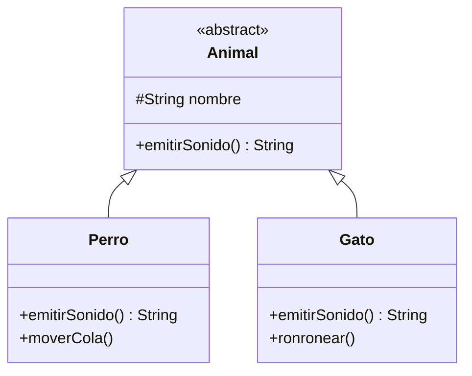

## 6.11 Ejemplo funcional

```java
public abstract class Vehiculo {
    protected final String marca;
    protected int velocidad;

    public Vehiculo(String marca) {
        this.marca = marca;
        this.velocidad = 0;
    }

    public void acelerar(int delta) {
        velocidad += delta;
    }

    public abstract int numeroRuedas();

    public String descripcion() {
        return marca + " (" + numeroRuedas() + " ruedas)";
    }
}

public class Automovil extends Vehiculo {
    public Automovil(String marca) { super(marca); }

    @Override
    public int numeroRuedas() { return 4; }

    public void abrirMaletero() {
        System.out.println("Maletero abierto");
    }
}

public class Motocicleta extends Vehiculo {
    public Motocicleta(String marca) { super(marca); }

    @Override
    public int numeroRuedas() { return 2; }
}

public class Camion extends Vehiculo {
    private final int cargaMaxima;

    public Camion(String marca, int cargaMaxima) {
        super(marca);
        this.cargaMaxima = cargaMaxima;
    }

    @Override
    public int numeroRuedas() { return 6; }

    public int getCargaMaxima() { return cargaMaxima; }
}
```

## 6.12 Explicación paso a paso

1. `Vehiculo` define **atributos comunes** (`marca`, `velocidad`) y **comportamiento abstracto** (`numeroRuedas`).
2. Cada subclase **hereda** `marca`, `velocidad`, `acelerar`, `descripcion`.
3. Cada subclase **implementa** `numeroRuedas` a su manera (polimorfismo).
4. La subclase `Camion` añade atributos y métodos propios (`cargaMaxima`).
5. `super(marca)` invoca el constructor de `Vehiculo` para inicializar el estado heredado.

## 6.13 ¿Cuándo usar herencia?

- Cuando se cumple **"es un"** claramente.
- Cuando la subclase **reutiliza estructura y comportamiento** de la base.
- Cuando la evolución **no rompe** el contrato de la superclase.

## 6.14 ¿Cuándo preferir composición?

- Cuando la relación es **"tiene un"**.
- Cuando se quiere **evitar acoplamiento fuerte**.
- Cuando sólo necesitas **reutilizar comportamiento** de otra clase (no identidad).

> **Regla heurística**: "Favorece composición sobre herencia" (Design Patterns, GoF).

## 6.15 Problema de herencia profunda

Jerarquías muy profundas generan:
- **Rigidez**: cambios en la base afectan toda la jerarquía.
- **Difícil comprensión**.
- **Fragile Base Class Problem**: modificar la base puede romper subclases sutilmente.

## 6.16 Principio de Sustitución de Liskov (LSP)

> "Los objetos de una subclase deben poder sustituir a los de la superclase **sin alterar la corrección** del programa."

Violación clásica: `Cuadrado extends Rectangulo` cuando la superclase asume `ancho != alto`.

```java
class Rectangulo {
    protected int ancho, alto;
    public void setAncho(int a) { ancho = a; }
    public void setAlto(int a)  { alto = a; }
    public int area() { return ancho * alto; }
}

class Cuadrado extends Rectangulo {
    // Si el cliente hace r.setAncho(5); r.setAlto(10); espera area=50
    // Pero Cuadrado fuerza ancho == alto → violación de LSP
}
```

La solución correcta no es "heredar Cuadrado de Rectángulo", sino modelarlos como abstracciones separadas bajo una interfaz común (`Figura`), o hacerlos inmutables.

## 6.17 Errores comunes

1. Usar herencia cuando la relación es "tiene un".
2. Olvidar `super(...)` cuando la superclase no tiene constructor sin argumentos.
3. Sobrescribir sin `@Override`.
4. Violar LSP.
5. Abusar de jerarquías profundas.
6. Declarar atributos `protected` en lugar de `private` + getters protegidos.
7. Heredar sólo para **reutilizar código**, no por semántica.

## 6.18 Preguntas de evaluación

1. Define herencia y su relación "es un".
2. ¿Por qué Java no soporta herencia múltiple de clases?
3. ¿Qué diferencia hay entre `protected` y `private`?
4. ¿Qué hace `super(...)`?
5. ¿Qué es una jerarquía multinivel?
6. ¿Cuándo NO usar herencia?
7. Explica el principio de Liskov con un ejemplo de violación.
8. ¿Por qué se dice "favorece composición sobre herencia"?
9. ¿Qué es el "Fragile Base Class Problem"?
10. ¿Cuál es la diferencia entre reutilizar por herencia y por composición?

### En pocas palabras

> **Herencia** modela "es un". Reutiliza y especializa. Pero **composición** suele ser mejor cuando la relación no es taxonómica o cuando se busca desacoplar.

---

# 7. Polimorfismo

## 7.1 Definición

**Polimorfismo** (del griego: *poly* = muchos, *morphē* = forma) es la capacidad de que **una misma interfaz** presente **múltiples comportamientos**.

En POO, se refiere a que **una referencia a un tipo general** puede apuntar a objetos de **subtipos concretos** y ejecutar **su comportamiento específico**.

## 7.2 Tipos de polimorfismo

### En tiempo de compilación: **Overloading**

Múltiples métodos con **mismo nombre** pero **distinta firma** en la **misma clase**.

### En tiempo de ejecución: **Overriding**

La subclase redefine un método de la superclase. El método invocado depende del **tipo real** del objeto.

### Polimorfismo paramétrico

Los **genéricos** (`List<T>`, `Map<K,V>`) permiten escribir código que opera uniformemente sobre distintos tipos sin perder seguridad de tipos. Es otra forma de polimorfismo.

## 7.3 Overloading

### ¿Qué es?

Definir **varios métodos** con el mismo nombre pero diferente **lista de parámetros**.

### Reglas

- Deben diferir en **número, tipo o orden** de parámetros.
- **No** basta cambiar el **tipo de retorno**.
- Pueden diferir en **modificadores de acceso**.

### Ejemplo

```java
public class Calculadora {
    public int sumar(int a, int b) { return a + b; }
    public int sumar(int a, int b, int c) { return a + b + c; }
    public double sumar(double a, double b) { return a + b; }
}
```

### Cuándo ocurre

En **tiempo de compilación**: el compilador decide cuál invocar según los argumentos.

## 7.4 Overriding

### ¿Qué es?

Redefinir un método **heredado** con **la misma firma** en la subclase.

### Reglas

- **Misma firma** (nombre + parámetros).
- **Tipo de retorno covariante** (puede ser subtipo).
- **No reducir visibilidad** (no puedes cambiar `public` a `private`).
- **No lanzar excepciones más amplias** (checked).
- Usar `@Override` para que el compilador valide.

### Ejemplo

```java
public class Animal {
    public String sonido() { return "..."; }
}

public class Perro extends Animal {
    @Override
    public String sonido() { return "Guau"; }
}
```

## 7.5 Overloading vs overriding

| Aspecto | Overloading (Sobrecarga) | Overriding (Sobrescritura) |
|---------|---------------------------|----------------------------|
| Relación | Misma clase | Herencia (subclase reescribe) |
| Firma | Diferente | Idéntica |
| Momento de resolución | Compilación | Ejecución |
| Tipo de retorno | Puede variar libremente | Covariante |
| Visibilidad | Libre | No puede reducirse |
| Palabra clave | — | `@Override` recomendado |
| Propósito | Ofrecer variantes | Especializar comportamiento |

## 7.6 Despacho dinámico

El método ejecutado se decide por el **tipo real del objeto**, no por el tipo de la referencia.

```java
Animal a = new Perro();
a.sonido(); // "Guau" — despacho dinámico
```

## 7.7 Ejemplo gráfico

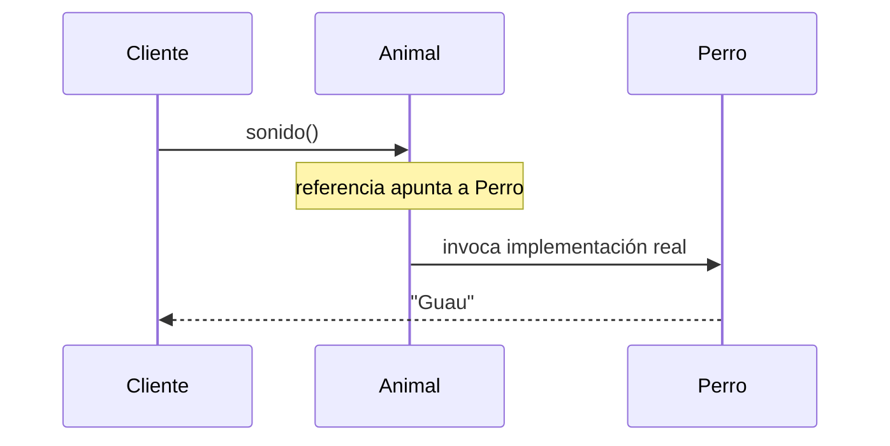

## 7.8 Ejemplo funcional

```java
public class Animal {
    public String sonido() { return "..."; }
    public void presentarse() {
        System.out.println("Soy un animal y hago " + sonido());
    }
}

public class Perro extends Animal {
    @Override
    public String sonido() { return "Guau"; }
}

public class Gato extends Animal {
    @Override
    public String sonido() { return "Miau"; }
}

public class Main {
    public static void main(String[] args) {
        Animal[] animales = { new Perro(), new Gato(), new Animal() };
        for (Animal a : animales) {
            a.presentarse(); // polimorfismo
        }
    }
}
```

## 7.9 Explicación línea por línea

1. `Animal` define `sonido()` y `presentarse()`.
2. `Perro` y `Gato` **sobrescriben** `sonido()`.
3. En el bucle, `a` es de tipo `Animal`, pero el objeto real es `Perro` o `Gato`.
4. `a.presentarse()` invoca el método de `Animal`, que a su vez llama a `sonido()`.
5. `sonido()` **despacha dinámicamente** a la implementación real.

## 7.10 Error típico

Creer que `Animal a = new Perro(); a.moverCola();` funcionará. **No**: la referencia es `Animal`, y `moverCola()` no existe en `Animal`. Requiere **cast**.

### Ejemplo incorrecto

```java
Animal a = new Perro();
a.moverCola(); // ERROR de compilación
```

### Ejemplo correcto

```java
if (a instanceof Perro p) { // pattern matching (Java 16+)
    p.moverCola();
}
```

## 7.11 Ejercicio

Diseña una jerarquía `Figura → Circulo, Rectangulo, Triangulo` con un método `area()` polimórfico. Calcula el área total de una lista.

## 7.12 Preguntas de examen

1. Define polimorfismo.
2. ¿Qué diferencia hay entre overloading y overriding?
3. ¿Qué es despacho dinámico?
4. ¿Puede existir overriding sin herencia?
5. ¿Puede existir overloading sin herencia?
6. ¿Por qué el tipo de retorno no basta para sobrecargar?
7. ¿Qué hace `@Override`?
8. ¿Cómo se decide qué método ejecutar en despacho dinámico?
9. ¿Qué pasa si intento llamar un método específico de la subclase usando una referencia padre?
10. ¿Qué es polimorfismo paramétrico? (mencionar genéricos)

### En pocas palabras

> **Polimorfismo** = mismo mensaje, distintas respuestas. **Overloading** = compile-time, misma clase. **Overriding** = runtime, herencia. El **despacho dinámico** materializa el polimorfismo.

---

# 8. UML y Relaciones entre Clases

## 8.1 ¿Qué es UML?

**Unified Modeling Language (UML)** es un **lenguaje de modelado** estandarizado (OMG) que permite **visualizar, especificar, construir y documentar** sistemas de software.

### Objetivo

- Comunicar diseño entre stakeholders.
- Documentar arquitectura.
- Facilitar análisis antes de codificar.

### Importancia

Es el **estándar de facto** en ingeniería de software; usado en análisis, diseño y documentación.

### UML NO es un lenguaje de programación

Es un **lenguaje de modelado**: describe, no ejecuta.

## 8.2 Diagramas UML

### Estructurales

- **Clases**: clases, atributos, métodos, relaciones.
- **Objetos**: instancias en un momento dado.
- **Componentes**: módulos físicos.
- **Despliegue**: hardware + software.
- **Paquetes**: agrupaciones lógicas.

### De comportamiento

- **Casos de uso**: interacción actor-sistema.
- **Secuencia**: mensajes en el tiempo.
- **Actividades**: flujos de trabajo.
- **Estados**: ciclos de vida.

## 8.3 Diagrama de clases (profundidad)

Símbolos básicos:

- **Clase**: rectángulo con 3 compartimentos (nombre, atributos, métodos).
- **Visibilidad**: `+` público, `-` privado, `#` protegido, `~` paquete.
- **Abstracto**: nombre en cursiva o `{abstract}`.
- **Estático**: subrayado.

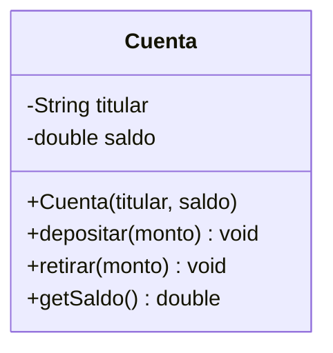

## 8.4 Relaciones entre clases

### Asociación

- **Significado**: vínculo estructural entre clases.
- **Representación**: línea sólida.
- **Cardinalidad**: `1`, `0..1`, `*`, `1..*`.
- **Ejemplo**: `Cliente` — `Pedido`.
- **Java**: atributo de referencia.

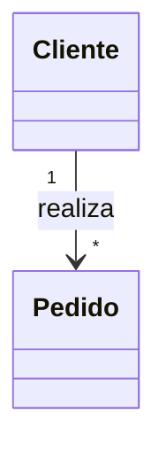

```java
public class Cliente {
    private List<Pedido> pedidos = new ArrayList<>();
}
```

### Agregación

- **Significado**: relación **todo-parte** débil. La parte **puede existir** sin el todo.
- **Representación**: línea con **rombo vacío**.
- **Ejemplo**: `Universidad` ◇— `Profesor`.
- **Java**: referencia a otras instancias, sin ciclo de vida ligado.

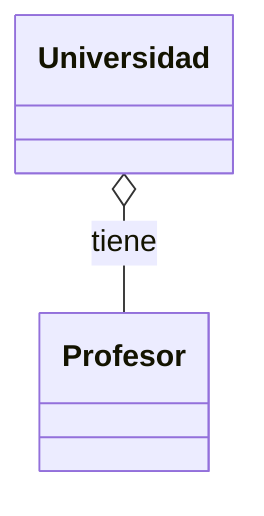

```java
public class Universidad {
    private List<Profesor> profesores;
}
```

### Composición

- **Significado**: todo-parte **fuerte**. La parte **no existe** sin el todo.
- **Representación**: línea con **rombo relleno**.
- **Ejemplo**: `Casa` ◆— `Habitacion`.
- **Ciclo de vida**: la parte muere con el todo.
- **Java**: la parte se **crea dentro** del todo.

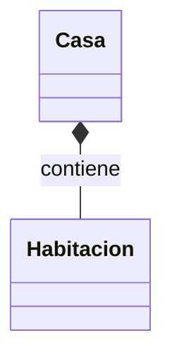

```java
public class Casa {
    private final List<Habitacion> habitaciones;
    public Casa() {
        this.habitaciones = List.of(new Habitacion("Sala"), new Habitacion("Cocina"));
    }
}
```

### Herencia / Generalización

- **Significado**: relación "es un".
- **Representación**: línea con **triángulo vacío**.

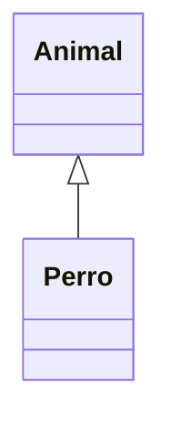

### Dependencia

- **Significado**: una clase **usa** a otra (parámetro, variable local).
- **Representación**: línea **discontinua** con flecha abierta.

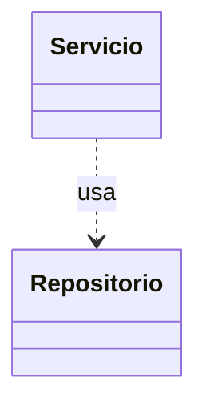

```java
public class Servicio {
    public void procesar(Repositorio repo) { repo.guardar(); }
}
```

### Realización

- **Significado**: una clase **implementa** una interfaz.
- **Representación**: línea **discontinua** con **triángulo vacío**.

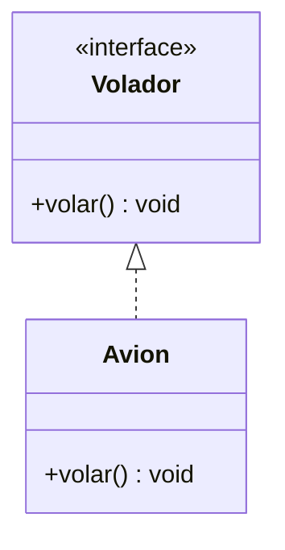

## 8.5 Tabla resumen de relaciones

| Relación | Símbolo | Semántica | Fuerza | Ciclo de vida |
|----------|---------|-----------|--------|---------------|
| Asociación | línea | "conoce a" | débil | independiente |
| Agregación | ◇— | "tiene" | media | independiente |
| Composición | ◆— | "contiene" | fuerte | ligado |
| Herencia | ◁— | "es un" | fuerte | N/A |
| Dependencia | ⇢ | "usa" | muy débil | N/A |
| Realización | ◁⇢ | "implementa" | media | N/A |

## 8.6 UML → Código

### Ejemplo: herencia

```
      Vehiculo (abstract)
          ▲
          |
      Automovil
```

```java
public abstract class Vehiculo { }
public class Automovil extends Vehiculo { }
```

### Ejemplo: interface

```
    <<interface>>
      Volador
         ▲
         |
       Avion
```

```java
public interface Volador { void volar(); }
public class Avion implements Volador {
    @Override public void volar() { }
}
```

### Ejemplo: asociación con cardinalidad

```
    Cliente 1 ──── * Pedido
```

```java
public class Cliente {
    private List<Pedido> pedidos = new ArrayList<>();
}
public class Pedido { }
```

### Ejemplo: composición

```
    Casa 1 ◆── * Habitacion
```

```java
public class Casa {
    private final List<Habitacion> habitaciones = new ArrayList<>();
    public Casa() { habitaciones.add(new Habitacion()); }
}
```

### Ejemplo: dependencia

```
    Servicio ⇢ Repositorio
```

```java
public class Servicio {
    public void ejecutar(Repositorio r) { r.guardar(); }
}
```

## 8.7 Código → UML

Dado:

```java
public class Universidad {
    private String nombre;
    private List<Departamento> departamentos;
}

public class Departamento {
    private String nombre;
    private List<Profesor> profesores;
}

public abstract class Persona { }
public class Profesor extends Persona { }
```

Se identifica:

- Clases: `Universidad`, `Departamento`, `Profesor`, `Persona`.
- Herencia: `Profesor` hereda de `Persona`.
- Composición: `Universidad ◆— Departamento`.
- Agregación: `Departamento ◇— Profesor`.

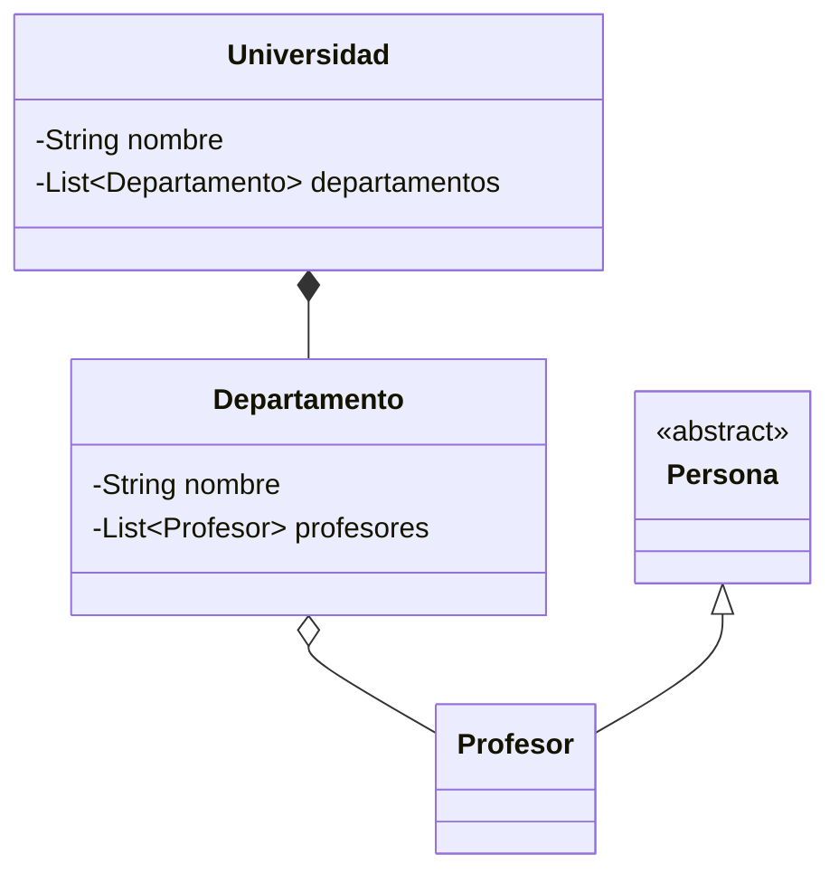

## 8.8 Errores comunes

1. Confundir **agregación** con **composición**.
2. Marcar **asociación** cuando es **dependencia**.
3. Usar **flechas de herencia** para relaciones todo-parte.
4. Olvidar **cardinalidades**.
5. Mezclar **niveles de abstracción** en un mismo diagrama.
6. Asumir que agregación/composición se distingue sólo por código; también depende del **ciclo de vida** semántico.

### En pocas palabras

> UML es el **lenguaje del diseño**. Sus relaciones clave: **asociación, agregación, composición, herencia, dependencia, realización**. Saber diferenciarlas es saber leer cualquier diagrama.

---

# 9. Principios de Diseño Orientado a Objetos

## 9.1 Cohesión y acoplamiento

- **Cohesión**: grado en que los elementos de un módulo/clase están relacionados entre sí. **Alta cohesión** es deseable.
- **Acoplamiento**: grado de dependencia entre módulos/clases. **Bajo acoplamiento** es deseable.

Una clase con **alta cohesión y bajo acoplamiento** es fácil de entender, probar y modificar.

## 9.2 Principios SOLID

- **S — Single Responsibility Principle (SRP)**: una clase debe tener una sola razón para cambiar.
- **O — Open/Closed Principle (OCP)**: abierta a extensión, cerrada a modificación. Se materializa con polimorfismo e interfaces.
- **L — Liskov Substitution Principle (LSP)**: los subtipos deben poder sustituir a sus supertipos sin romper el programa.
- **I — Interface Segregation Principle (ISP)**: es mejor varias interfaces específicas que una interfaz general. Los clientes no deben depender de métodos que no usan.
- **D — Dependency Inversion Principle (DIP)**: depende de abstracciones, no de implementaciones concretas.

## 9.3 Composición sobre herencia

Cuando la relación no es claramente "es un", o cuando sólo se busca reutilizar comportamiento, la **composición** ofrece más flexibilidad y menor acoplamiento.

```java
// ❌ Herencia por reutilización
class Stack<T> extends ArrayList<T> { ... }

// ✅ Composición
class Stack<T> {
    private final List<T> elementos = new ArrayList<>();
    public void push(T e) { elementos.add(e); }
    public T pop() { return elementos.remove(elementos.size() - 1); }
}
```

## 9.4 Inmutabilidad

Un objeto **inmutable** no cambia su estado después de la construcción. Ventajas: seguridad en concurrencia, razonamiento más simple, uso seguro como claves en mapas.

```java
public final class Punto {
    private final int x, y;
    public Punto(int x, int y) { this.x = x; this.y = y; }
    public int getX() { return x; }
    public int getY() { return y; }
}
```

## 9.5 Diseño orientado a comportamiento

Prefiere métodos con **sentido de negocio** sobre getters/setters genéricos. El objeto debe **saber hacer**, no sólo **exponer**.

## 9.6 Preguntas de evaluación

1. ¿Qué es cohesión? ¿Qué es acoplamiento?
2. ¿Por qué conviene alta cohesión y bajo acoplamiento?
3. Explica los cinco principios SOLID con ejemplos.
4. ¿Cuándo conviene composición sobre herencia?
5. ¿Qué ventajas tiene la inmutabilidad?
6. ¿Qué significa "Tell, Don't Ask"?
7. ¿Cómo se relaciona OCP con polimorfismo?
8. ¿Cómo afecta DIP al testing?
9. ¿Qué problema resuelve ISP?
10. ¿Cómo se relaciona LSP con herencia?

---

# 10. Sistema Integrador: Sistema Académico

## 10.1 Requerimiento conceptual

Diseñar un sistema que gestione:

- **Personas** (estudiantes, profesores).
- **Cursos** impartidos por profesores.
- **Inscripciones** de estudiantes en cursos.
- Cálculo de **promedios**.

## 10.2 Identificación de clases

- `Persona` (abstracta) — base.
- `Estudiante` — hereda de `Persona`.
- `Profesor` — hereda de `Persona`.
- `Curso` — compuesto por contenido propio; asociado a un `Profesor`.
- `Inscripcion` — vincula a un `Estudiante` con un `Curso`.
- `Evaluable` (interfaz) — define `calcularPromedio()`.

## 10.3 Diagrama UML

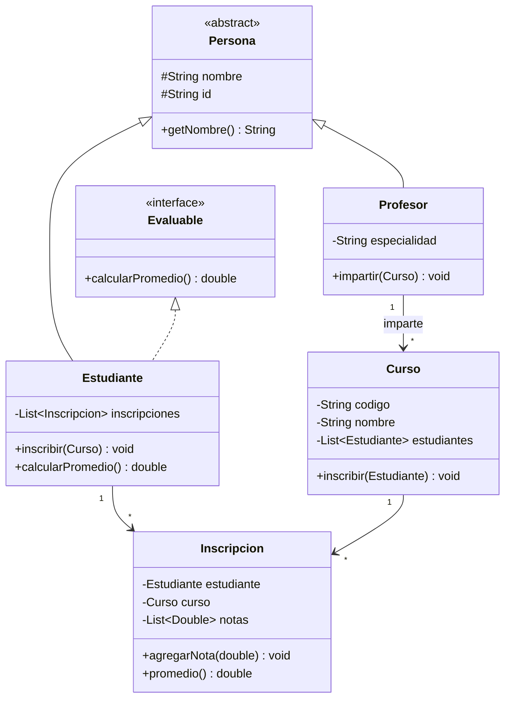

## 10.4 Relaciones

- **Herencia**: `Estudiante`, `Profesor` → `Persona`.
- **Realización**: `Estudiante` implementa `Evaluable`.
- **Asociación**: `Inscripcion` ↔ `Estudiante`, `Inscripcion` ↔ `Curso`.
- **Agregación**: `Profesor ◇— Curso` (un profesor puede dejar de impartir sin destruir el curso).

## 10.5 Código Java

```java
// ===== Abstracción =====
public abstract class Persona {
    protected final String nombre;
    protected final String id;

    public Persona(String nombre, String id) {
        if (nombre == null || nombre.isBlank()) throw new IllegalArgumentException();
        this.nombre = nombre;
        this.id = id;
    }

    public String getNombre() { return nombre; }
    public String getId() { return id; }
}

// ===== Interface =====
public interface Evaluable {
    double calcularPromedio();
}

// ===== Especialización =====
public class Estudiante extends Persona implements Evaluable {
    private final List<Inscripcion> inscripciones = new ArrayList<>();

    public Estudiante(String nombre, String id) { super(nombre, id); }

    public void inscribir(Curso curso) {
        if (curso == null) throw new IllegalArgumentException();
        Inscripcion i = new Inscripcion(this, curso);
        inscripciones.add(i);
        curso.inscribir(this);
    }

    public List<Inscripcion> getInscripciones() { return List.copyOf(inscripciones); }

    @Override
    public double calcularPromedio() {
        return inscripciones.stream()
            .mapToDouble(Inscripcion::promedio)
            .average()
            .orElse(0.0);
    }
}

public class Profesor extends Persona {
    private final String especialidad;
    private final List<Curso> cursos = new ArrayList<>();

    public Profesor(String nombre, String id, String especialidad) {
        super(nombre, id);
        this.especialidad = especialidad;
    }

    public void impartir(Curso curso) {
        cursos.add(curso);
        curso.asignarProfesor(this);
    }

    public String getEspecialidad() { return especialidad; }
}

// ===== Asociación bidireccional =====
public class Curso {
    private final String codigo;
    private final String nombre;
    private Profesor profesor;
    private final List<Estudiante> estudiantes = new ArrayList<>();

    public Curso(String codigo, String nombre) {
        this.codigo = codigo;
        this.nombre = nombre;
    }

    public void asignarProfesor(Profesor p) { this.profesor = p; }
    public void inscribir(Estudiante e) { estudiantes.add(e); }
    public String getCodigo() { return codigo; }
    public String getNombre() { return nombre; }
    public List<Estudiante> getEstudiantes() { return List.copyOf(estudiantes); }
}

// ===== Asociación con estado propio =====
public class Inscripcion {
    private final Estudiante estudiante;
    private final Curso curso;
    private final List<Double> notas = new ArrayList<>();

    public Inscripcion(Estudiante estudiante, Curso curso) {
        this.estudiante = estudiante;
        this.curso = curso;
    }

    public void agregarNota(double nota) {
        if (nota < 0 || nota > 5) throw new IllegalArgumentException();
        notas.add(nota);
    }

    public double promedio() {
        return notas.stream().mapToDouble(Double::doubleValue).average().orElse(0.0);
    }

    public Estudiante getEstudiante() { return estudiante; }
    public Curso getCurso() { return curso; }
}
```

## 10.6 Ejecución conceptual

```java
Profesor prof = new Profesor("Dr. García", "P001", "Matemáticas");
Curso calculo = new Curso("MAT101", "Cálculo I");
prof.impartir(calculo);

Estudiante ana = new Estudiante("Ana", "E001");
Estudiante luis = new Estudiante("Luis", "E002");
ana.inscribir(calculo);
luis.inscribir(calculo);

ana.getInscripciones().get(0).agregarNota(4.5);
ana.getInscripciones().get(0).agregarNota(4.0);
luis.getInscripciones().get(0).agregarNota(3.5);

// Polimorfismo
List<Evaluable> evaluables = List.of(ana, luis);
for (Evaluable e : evaluables) {
    System.out.println("Promedio: " + e.calcularPromedio());
}
```

## 10.7 Los cuatro pilares en acción

- **Abstracción**: `Persona` y `Evaluable` definen contratos.
- **Encapsulamiento**: atributos `private`/`protected final`, validaciones.
- **Herencia**: `Estudiante`, `Profesor` extienden `Persona`.
- **Polimorfismo**: `List<Evaluable>` opera sobre cualquier implementación.

## 10.8 Análisis de decisiones de diseño

1. **`Persona` es abstracta** porque no tiene sentido instanciarla directamente.
2. **`Evaluable` es interfaz** porque es una **capacidad** ("puede ser evaluado"), no una identidad.
3. **`Inscripcion` es una clase intermedia** (patrón clásico) porque la relación Estudiante–Curso tiene **estado propio** (notas).
4. **Asociación bidireccional** entre `Curso` y `Estudiante` para navegar en ambos sentidos; conviene mantenerla consistente.

---

# 11. ¿Cómo se relacionan todos los conceptos?

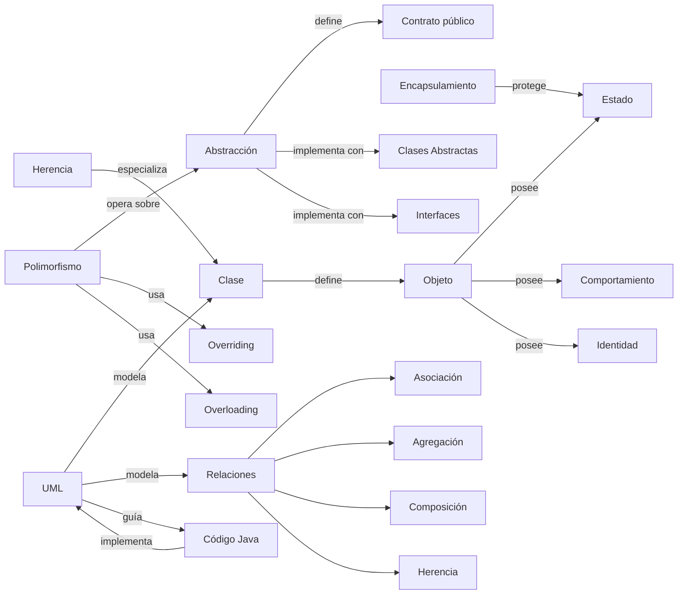

**Lectura**: Una **clase** define **objetos**; los objetos tienen **estado, comportamiento e identidad**. El **encapsulamiento** protege el estado; la **abstracción** define qué ve el consumidor; la **herencia** permite especializar; el **polimorfismo** explota la abstracción. **UML** modela todo esto; el **código** lo implementa.

---

# 12. Banco de Preguntas

## Nivel 1 — Conceptual (20)

1. ¿Qué es la POO?
2. ¿Qué es un objeto?
3. ¿Qué es una clase?
4. ¿Qué es un atributo?
5. ¿Qué es un método?
6. ¿Qué es la herencia?
7. ¿Qué es el polimorfismo?
8. ¿Qué es el encapsulamiento?
9. ¿Qué es la abstracción?
10. ¿Qué es una interfaz?
11. ¿Qué es una clase abstracta?
12. ¿Qué es un constructor?
13. ¿Qué es `static`?
14. ¿Qué es UML?
15. ¿Qué es una asociación en UML?
16. ¿Qué es una agregación?
17. ¿Qué es una composición?
18. ¿Qué es la sobrecarga (overloading)?
19. ¿Qué es la sobrescritura (overriding)?
20. ¿Qué es la identidad de un objeto?

## Nivel 2 — Comprensión (20)

1. Explica con tus palabras por qué existen las interfaces.
2. ¿Por qué los atributos deben ser `private`?
3. ¿Por qué Java no tiene destructores?
4. ¿Por qué conviene favorecer composición sobre herencia?
5. Explica la diferencia entre overloading y overriding con un ejemplo.
6. ¿Por qué una clase abstracta puede tener constructor?
7. ¿Por qué existen los métodos `default` en interfaces (Java 8+)?
8. Explica el principio de Liskov con un ejemplo.
9. ¿Por qué el despacho dinámico es clave en polimorfismo?
10. ¿Por qué UML es importante antes de codificar?
11. Explica el "Fragile Base Class Problem".
12. ¿Cuándo conviene una interfaz sobre una clase abstracta?
13. ¿Cuándo conviene una clase abstracta sobre una interfaz?
14. Explica la diferencia entre agregación y composición.
15. ¿Cómo afecta el uso excesivo de `static` al testing?
16. ¿Por qué se dice que la POO modela el dominio?
17. ¿Cómo interactúan abstracción y polimorfismo?
18. Explica la diferencia entre asociación y dependencia.
19. ¿Qué significa que un objeto encapsula su estado?
20. ¿Cómo se relaciona UML con el código?

## Nivel 3 — Análisis (20)

1. Analiza un sistema real (biblioteca) y propón 5 clases con responsabilidades.
2. Dado un problema de modelado, decide si usar herencia o composición. Justifica.
3. Analiza cuándo la POO puede ser contraproducente.
4. Dado un diagrama UML, identifica violaciones a LSP.
5. Analiza por qué un getter puede romper el encapsulamiento.
6. Analiza cuándo conviene una jerarquía profunda vs plana.
7. Propón un caso donde el polimorfismo se resuelve mejor con una interfaz.
8. Justifica por qué una clase anémica es un anti-patrón.
9. Analiza la cohesión y acoplamiento de dos diseños alternativos.
10. Dado un sistema de pagos, propón las abstracciones clave.
11. Evalúa: ¿es correcto usar `extends` solo para reutilizar código?
12. Analiza el impacto del uso excesivo de herencia múltiple.
13. ¿Cómo afecta la inmutabilidad al diseño?
14. ¿Qué problemas surgen al exponer referencias mutables?
15. Compara dos formas de implementar polimorfismo (herencia vs delegación).
16. Analiza cómo el uso de interfaces reduce acoplamiento.
17. Dado un diagrama, identifica relaciones mal marcadas.
18. Justifica por qué un método `static` no puede ser polimórfico.
19. ¿Cuándo un constructor privado es apropiado?
20. Analiza por qué los métodos `default` en interfaces pueden ser peligrosos.

## Nivel 4 — Código (15)

1. Escribe una clase `Círculo` con encapsulamiento completo.
2. Implementa una jerarquía `Animal → Perro, Gato` con polimorfismo.
3. Corrige un código que usa `public` en atributos y accesos directos.
4. Implementa una interfaz `Comparable` para una clase `Estudiante`.
5. Escribe dos constructores sobrecargados y explica.
6. Implementa una composición `Motor` dentro de `Automovil`.
7. Escribe un ejemplo de overriding con `@Override`.
8. Escribe un ejemplo de overloading con tipos distintos.
9. Implementa un método `static` de utilidad.
10. Corrige un código que viola LSP.
11. Implementa un patrón de delegación (composición) para reutilizar comportamiento.
12. Diseña una clase inmutable `Persona`.
13. Escribe código que use `try-with-resources`.
14. Implementa una clase que herede e implemente una interfaz.
15. Dado un problema, decide entre clase abstracta e interfaz y escribe el código.

## Nivel 5 — UML (15)

1. Dibuja el diagrama de clases de `Cuenta` y `Cliente`.
2. Modela la relación `Universidad — Departamento — Profesor`.
3. Modela una composición `Casa — Habitación`.
4. Modela una agregación `Equipo — Jugador`.
5. Representa una herencia `Forma — Círculo, Cuadrado`.
6. Modela una interfaz `Pago` con implementaciones `Tarjeta`, `Efectivo`.
7. Representa la relación de dependencia `Servicio → Repositorio`.
8. Modela un diagrama de secuencia para una compra.
9. Modela un diagrama de estados para un `Pedido`.
10. Modela un diagrama de casos de uso para un cajero.
11. Convierte un diagrama dado a código Java.
12. Convierte código Java a un diagrama.
13. Identifica cardinalidades en un diagrama dado.
14. Distingue relaciones mal marcadas.
15. Modela un sistema académico completo.

---

# 13. Simulacro de Evaluación

**Instrucciones**: responda todas las preguntas. Tiempo sugerido: 90 minutos.

### Parte I — Selección Múltiple (10)

1. ¿Cuál NO es un pilar de la POO?
   a) Abstracción  b) Encapsulamiento  c) Compilación  d) Polimorfismo

2. La sobrecarga (overloading) se resuelve en:
   a) Runtime  b) Compilación  c) Ejecución diferida  d) Ninguna

3. ¿Qué modificador expone un atributo solo a la jerarquía y al paquete?
   a) public  b) private  c) protected  d) default

4. ¿Cuál relación UML implica ciclo de vida ligado?
   a) Asociación  b) Agregación  c) Composición  d) Dependencia

5. ¿Qué palabra reservada invoca al constructor del padre?
   a) this  b) parent  c) super  d) base

6. Un método `static`:
   a) Puede sobrescribirse  b) No puede acceder a `this`
   c) Es polimórfico  d) Requiere instancia

7. ¿Qué principio establece que las subclases deben poder sustituir a la superclase?
   a) DRY  b) LSP  c) SRP  d) KISS

8. Un método `default` en una interfaz:
   a) Es abstracto  b) Tiene implementación
   c) Es privado  d) No existe en Java

9. ¿Cuál es la unidad básica de la POO?
   a) Función  b) Procedimiento  c) Objeto  d) Variable

10. ¿Qué representa un rombo relleno en UML?
    a) Agregación  b) Composición  c) Herencia  d) Dependencia

### Parte II — Verdadero/Falso justificado (5)

11. En Java, dos objetos con el mismo estado son idénticos.
12. Las interfaces pueden tener atributos mutables.
13. Una clase abstracta puede no tener métodos abstractos.
14. `@Override` es obligatorio para sobrescribir.
15. Un constructor privado impide instanciar la clase directamente.

### Parte III — Análisis de Código (5)

```java
public class A {
    public int x;
}
public class B extends A {
    public void setX(int v) { x = v; }
}
```

16. ¿Qué problema de diseño identificas?

```java
public class Figura { public double area() { return 0; } }
public class Circulo extends Figura {
    private double r;
    @Override public double area() { return Math.PI * r * r; }
}
```

17. ¿Se está usando polimorfismo? Justifica.

18. ¿Por qué el siguiente código viola encapsulamiento?
```java
public class Cuenta {
    private List<String> movimientos = new ArrayList<>();
    public List<String> getMovimientos() { return movimientos; }
}
```

19. ¿Qué error tiene este código?
```java
public class Cuenta {
    private double saldo;
    public void setSaldo(double s) { saldo = s; }
}
```

20. ¿Qué hace el despacho dinámico aquí?
```java
A a = new B();
a.metodo();
```

### Parte IV — UML (5)

21. Dibuja un diagrama con `Autor 1 — * Libro` (asociación).
22. Modela `Motor` como composición de `Automovil`.
23. Modela una interfaz `Notificable` implementada por `Email` y `SMS`.
24. Representa la herencia `Empleado ← Gerente, Vendedor`.
25. Convierte el siguiente diagrama a código:

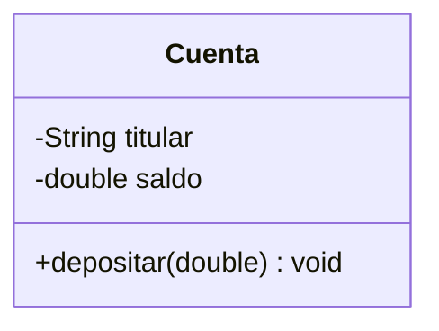

### Parte V — Preguntas Abiertas (5)

26. Explica con detalle la diferencia entre clase abstracta e interfaz. Da un ejemplo donde cada una sea la elección correcta.
27. Analiza: ¿por qué favorecer composición sobre herencia? Ilustra con un ejemplo.
28. Explica el polimorfismo con un ejemplo de código que muestre despacho dinámico.
29. Describe un sistema real y modela 4 clases con sus relaciones UML.
30. ¿Cómo se relacionan los cuatro pilares de la POO? Explica sus interacciones.

---

# Solucionario

### Parte I
1. c) Compilación
2. b) Compilación
3. c) protected
4. c) Composición
5. c) super
6. b) No puede acceder a `this`
7. b) LSP
8. b) Tiene implementación
9. c) Objeto
10. b) Composición

### Parte II
11. **Falso**. La identidad es distinta aunque el estado coincida.
12. **Falso**. Sólo constantes (`public static final`).
13. **Verdadero**. Puede existir sólo para bloquear instanciación o compartir código.
14. **Falso**. Es recomendable pero no obligatorio.
15. **Verdadero**. Es el patrón Singleton, entre otros.

### Parte III
16. **Violación de encapsulamiento**. `x` es público y modificable desde cualquier parte; `B` no controla la mutación.
17. **Sí**. `Circulo` sobrescribe `area()`; si se usa `Figura f = new Circulo()` y `f.area()`, hay despacho dinámico.
18. El getter **retorna la referencia mutable**, permitiendo modificaciones externas que evaden la clase. Debe devolverse copia o vista inmutable.
19. No hay validación ni reglas de negocio. Además, la existencia de `setSaldo` permite cualquier mutación sin control.
20. Se invoca la implementación de `metodo()` de `B`, no de `A`, porque el objeto real es `B`.

### Parte IV
21.
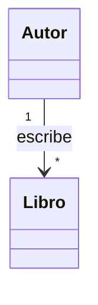
22.
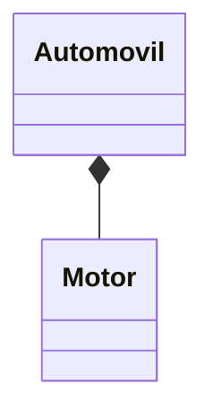
23.
```mermaid
classDiagram
    class Notificable {
        <<interface>>
        +enviar(String) void
    }
    class Email
    class SMS
    Notificable <|.. Email
    Notificable <|.. SMS
```
24.
```mermaid
classDiagram
    Empleado <|-- Gerente
    Empleado <|-- Vendedor
```
25.
```java
public class Cuenta {
    private final String titular;
    private double saldo;

    public Cuenta(String titular) { this.titular = titular; }

    public void depositar(double monto) {
        if (monto <= 0) throw new IllegalArgumentException();
        saldo += monto;
    }

    public String getTitular() { return titular; }
    public double getSaldo() { return saldo; }
}
```

### Parte V (respuestas razonadas)
26. Clase abstracta → estado compartido + contrato parcial (ej. `Empleado`). Interfaz → capacidad pura (ej. `Comparable`). Se elige clase abstracta cuando hay estado común que reutilizar; interfaz cuando se define una capacidad que múltiples clases no relacionadas pueden ofrecer.
27. Composición evita acoplamiento, favorece LSP y desacopla jerarquías (ej. `Automovil` tiene `Motor`). Ejemplo concreto: `Stack<T>` que **tiene** un `List<T>` en lugar de **extender** `ArrayList`.
28. Ejemplo: `Animal a = new Perro(); a.sonido();` → se ejecuta `Perro.sonido()` porque el objeto real es `Perro`, aunque la referencia sea `Animal`.
29. Depende del sistema, debe incluir clases, atributos, métodos y relaciones correctas.
30. Abstracción define el contrato, encapsulamiento lo protege, herencia lo especializa, polimorfismo lo explota.

---

# 14. Glosario

- **Abstracción**: modelar lo esencial, ignorar lo accesorio.
- **Acoplamiento**: grado de dependencia entre módulos.
- **Agregación**: relación todo-parte débil (rombo vacío).
- **Asociación**: vínculo estructural entre clases.
- **Atributo**: variable que forma parte del estado de un objeto.
- **Clase**: plantilla que describe atributos y métodos.
- **Clase abstracta**: clase no instanciable; puede tener métodos abstractos y concretos.
- **Cohesión**: grado en que los elementos de un módulo están relacionados.
- **Composición**: relación todo-parte fuerte (rombo relleno); ciclo de vida ligado.
- **Constructor**: método especial que inicializa una instancia.
- **Despacho dinámico**: selección del método a ejecutar basada en el tipo real del objeto.
- **Encapsulamiento**: ocultar el estado interno y exponer interfaz controlada.
- **Herencia**: mecanismo por el cual una subclase reutiliza y especializa.
- **Identidad**: propiedad única e irrepetible de un objeto.
- **Instancia**: objeto creado a partir de una clase.
- **Interfaz**: contrato que define métodos sin implementación (o con `default`).
- **Invariante**: condición que siempre debe cumplirse en un objeto válido.
- **LSP (Liskov Substitution Principle)**: los subtipos deben poder sustituir a sus supertipos.
- **Mensaje**: invocación de un método sobre un objeto.
- **Método**: operación que define el comportamiento.
- **Objeto**: instancia con estado, comportamiento e identidad.
- **OCP (Open/Closed Principle)**: abierta a extensión, cerrada a modificación.
- **Overloading** (sobrecarga): varios métodos con mismo nombre y distinta firma.
- **Overriding** (sobrescritura): redefinición de un método heredado.
- **Polimorfismo**: misma interfaz, distintos comportamientos.
- **Referencia**: variable que apunta a un objeto en memoria.
- **SRP (Single Responsibility Principle)**: una clase, una razón para cambiar.
- **UML**: Unified Modeling Language, lenguaje de modelado.
- **Visibilidad**: modificadores de acceso (`public`, `private`, `protected`, paquete).

---

# 15. Repaso de Alto Rendimiento

| Concepto | Definición | Palabra clave | Cómo reconocerlo |
|----------|------------|---------------|------------------|
| POO | Paradigma basado en objetos | Objetos + mensajes | Enunciados con "modelar", "entidades" |
| Clase | Plantilla | Molde | Declaración `class` |
| Objeto | Instancia | Real | `new`, `heap` |
| Encapsulamiento | Ocultar estado | `private`, getters | Atributos `private` + métodos |
| Abstracción | Modelar lo esencial | Contrato | `abstract`, `interface` |
| Herencia | Es un | `extends` | Flecha triangular UML |
| Polimorfismo | Misma interfaz, distintos comportamientos | Despacho | Referencia padre, objeto hijo |
| Overloading | Misma clase, distinta firma | Compilación | Varios métodos iguales en nombre |
| Overriding | Subclase redefine | Runtime | `@Override` |
| Asociación | Vínculo | "conoce a" | Línea simple |
| Agregación | Todo-parte débil | ◇— | Rombo vacío |
| Composición | Todo-parte fuerte | ◆— | Rombo relleno |
| Dependencia | Usa | ⇢ | Línea discontinua |
| Realización | Implementa | ◁⇢ | Línea discontinua + triángulo |
| `static` | De la clase | Compartido | `static`, acceso por clase |
| `final` | Constante/no heredable | Inmutable | `final` |

## Las 20 cosas que definitivamente debes saber

1. POO = objetos + mensajes + estado + comportamiento + identidad.
2. Cuatro pilares: **A**bstracción, **E**ncapsulamiento, **H**erencia, **P**olimorfismo.
3. Clase = plantilla; objeto = instancia.
4. `private` para atributos; `public` para API.
5. Getter ≠ encapsulamiento completo.
6. `static` = pertenece a la clase, no a la instancia.
7. Java no tiene destructores; usa `try-with-resources`.
8. Clase abstracta = puede tener estado + contrato parcial.
9. Interfaz = contrato puro, sin estado.
10. Herencia = "es un"; composición = "tiene un".
11. Favorece composición sobre herencia.
12. LSP: subclase sustituye a superclase sin romper.
13. Polimorfismo = despacho dinámico.
14. Overloading = compile-time; overriding = runtime.
15. `@Override` valida sobrescritura.
16. Asociación = conoce a; agregación = todo débil; composición = todo fuerte.
17. UML ≠ lenguaje de programación.
18. Diagrama de clases es el más importante para POO.
19. Cardinalidades: `1`, `0..1`, `*`, `1..*`.
20. Diseño > sintaxis. La POO es una **forma de pensar**.

---

# 16. Checklist Final de Preparación

- [ ] Puedo explicar qué es POO.
- [ ] Puedo diferenciar una clase de un objeto.
- [ ] Puedo explicar los cuatro pilares.
- [ ] Puedo diferenciar abstracción y encapsulamiento.
- [ ] Puedo explicar una clase abstracta.
- [ ] Puedo explicar una interfaz.
- [ ] Puedo diferenciar clase abstracta e interfaz.
- [ ] Puedo explicar encapsulamiento.
- [ ] Puedo utilizar modificadores de acceso.
- [ ] Puedo explicar constructores.
- [ ] Puedo explicar `static`.
- [ ] Puedo explicar `final`.
- [ ] Puedo explicar herencia.
- [ ] Puedo interpretar una relación de herencia en UML.
- [ ] Puedo explicar polimorfismo.
- [ ] Puedo diferenciar overloading y overriding.
- [ ] Puedo interpretar un diagrama de clases.
- [ ] Puedo identificar asociación.
- [ ] Puedo identificar agregación.
- [ ] Puedo identificar composición.
- [ ] Puedo transformar UML a código.
- [ ] Puedo deducir UML a partir de código.
- [ ] Puedo aplicar el Principio de Liskov.
- [ ] Puedo justificar composición sobre herencia.
- [ ] Puedo implementar una jerarquía polimórfica en Java.
- [ ] Puedo escribir código encapsulado con validaciones.
- [ ] Puedo diseñar un sistema pequeño de 4–6 clases con UML.
- [ ] Puedo explicar SRP, OCP, LSP, ISP y DIP.
- [ ] Puedo diferenciar `==` y `equals()`.
- [ ] Puedo explicar inmutabilidad y sus ventajas.

---

> *"El diseño orientado a objetos no se trata de clases; se trata de responsabilidades, colaboraciones y evolución."* — Rebecca Wirfs-Brock